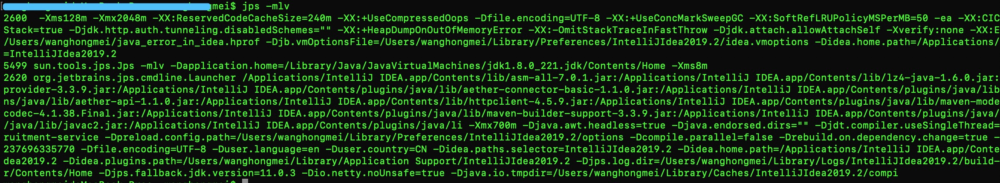
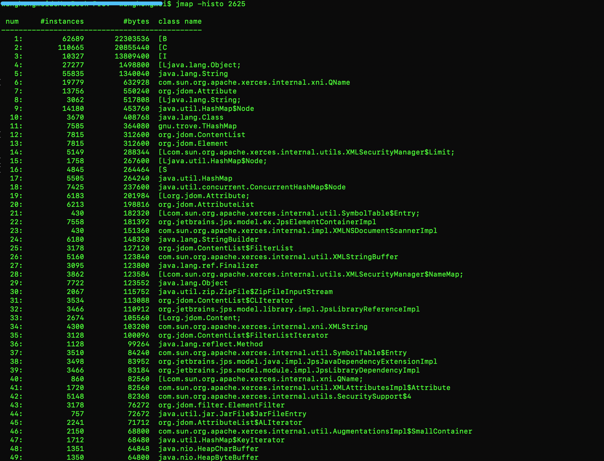

### 总结与实践
今天我介绍了 JDK 中用于监控及诊断的命令行工具。我们再来回顾一下。

- jps将打印所有正在运行的 Java 进程。
> 你可能用过ps命令，打印所有正在运行的进程的相关信息。JDK 中的jps命令（帮助文档）沿用了同样的概念：它将打印所有正在运行的 Java 进程的相关信息。
  在默认情况下，jps的输出信息包括 Java 进程的进程 ID 以及主类名。我们还可以通过追加参数，来打印额外的信息。例如，-l将打印模块名以及包名；-v将打印传递给 Java 虚拟机的参数（如-XX:+UnlockExperimentalVMOptions -XX:+UseZGC）；-m将打印传递给主类的参数。
  具体的示例如下所示：
  ```text
  $ jps -mlv
  18331 org.example.Foo Hello World
  18332 jdk.jcmd/sun.tools.jps.Jps -mlv -Dapplication.home=/Library/Java/JavaVirtualMachines/jdk-11.jdk/Contents/Home -Xms8m -Djdk.module.main=jdk.jcmd
```





> 需要注意的是，如果某 Java 进程关闭了默认开启的UsePerfData参数（即使用参数-XX:-UsePerfData），那么jps命令（以及下面介绍的jstat）将无法探知该 Java 进程。
当获得 Java 进程的进程 ID 之后，我们便可以调用接下来介绍的各项监控及诊断工具了。

- jstat允许用户查看目标 Java 进程的类加载、即时编译以及垃圾回收相关的信息。它常用于检测垃圾回收问题以及内存泄漏问题。


- jmap允许用户统计目标 Java 进程的堆中存放的 Java 对象，并将它们导出成二进制文件。
>jmap同样包括多条子命令。
 -clstats，该子命令将打印被加载类的信息。
 -finalizerinfo，该子命令将打印所有待 finalize 的对象。
 -histo，该子命令将统计各个类的实例数目以及占用内存，并按照内存使用量从多至少的顺序排列。此外，-histo:live只统计堆中的存活对象。
 -dump，该子命令将导出 Java 虚拟机堆的快照。同样，-dump:live只保存堆中的存活对象。
 我们通常会利用jmap -dump:live,format=b,file=filename.bin命令，将堆中所有存活对象导出至一个文件之中。

 
 这里format=b将使jmap导出与hprof（在 Java 9 中已被移除）、-XX:+HeapDumpAfterFullGC、-XX:+HeapDumpOnOutOfMemoryError格式一致的文件。这种格式的文件可以被其他 GUI 工具查看，具体我会在下一篇中进行演示。

- jinfo将打印目标 Java 进程的配置参数，并能够改动其中 manageabe 的参数。

- jstack将打印目标 Java 进程中各个线程的栈轨迹、线程状态、锁状况等信息。它还将自动检测死锁。

- jcmd则是一把瑞士军刀，可以用来实现前面除了jstat之外所有命令的功能。


-------MAT分析------
https://www.cnblogs.com/loong-hon/p/10475143.html
