1. sl 命令

你会看到一辆火车从屏幕右边开往左边……

安装
```
$ sudo apt-get install sl
```
运行
```
$ sl
```
命令有 -a l F e 几个选项，
```
-a An accident seems to happen. You'll feel pity for people who cry for help.

-l shows little one.

-F It flies.

-e Allow interrupt by Ctrl+C.
```

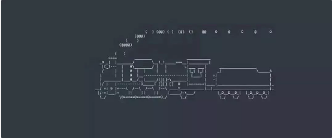


可以给别人来个恶作剧，他一敲ls，不知道的肯定很有效果
```
$alias ls=sl
```

2. fortune 命令

输出一句话，有笑话，名言什么的 (还有唐诗宋词sudo apt-get install fortune-zh)

安装
```
$sudo apt-get install fortune
```
运行
```
$fortune
```

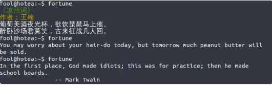   

3. cowsay 命令

用ASCII字符打印牛，羊等动物，还有个cowthink，这个是奶牛想，那个是奶牛说，哈哈，差不多

安装
```
$sudo apt-get install cowsay
```

运行
```
$cowsay "I am not a cow, hahaha"
```


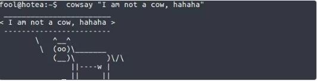   
```
$cowsay -l 查看其它动物的名字，然后 -f 跟上动物名，如
$cowsay -f tux "坑爹啊"
```
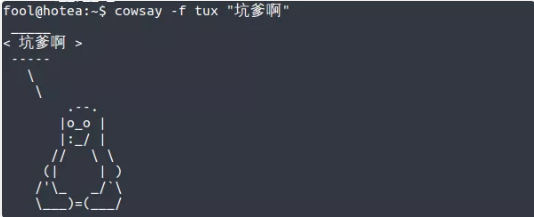  


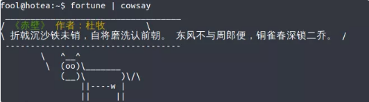   
还可以让cowsay说出fortune的内容，就像这样：
```
$fortune | cowsay
```


img
4. cmatrix 命令

这个很酷！《黑客帝国》那种矩阵风格的动画效果

安装
```
$ sudo apt-get install cmatrix
```
运行
```
$cmatrix
```


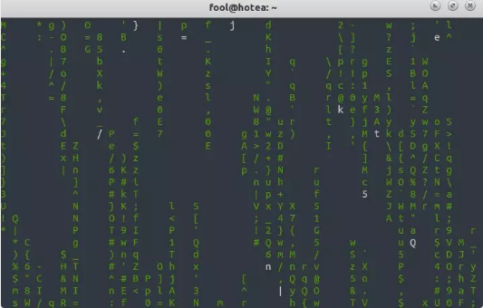           

5. figlet 、toilet命令

艺术字生成器，由ASCII字符组成，把文本显示成标题栏。此外还有banner这个命令

安装
```
$sudo apt-get install figlet

$sudo apt-get install toilet
```
运行
```
$figlet fuck you !

$toilet i love you
```


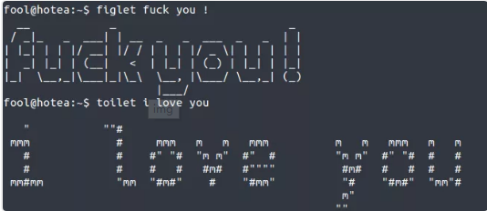   
toilet 还可以添加颜色，里面的选项请自己 man 一下
```
$ toilet -f mono12 -F gay a girl
```

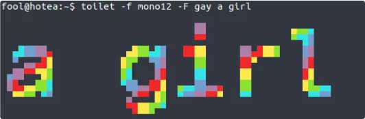   


6. oneko 命令

桌面上出现一直喵星人，跟着你的鼠标跑，你不动了它就睡觉。哈哈，这个挺不错

安装
```
$sudo apt-get install oneko
```
运行
```
$oneko
```
要关掉这家伙，按ctrl+c 结束

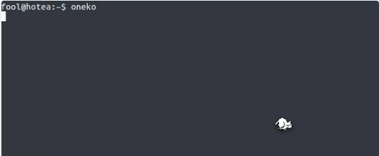   


7. xeyes 命令

在屏幕上出现一双眼睛，盯着你的鼠标指针

安装运行同上

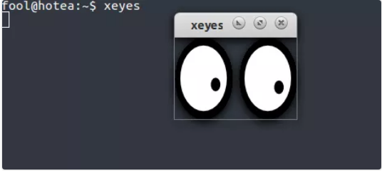   


8. yes 命令

输出无穷无尽的字符，按ctrl+c结束，如
```
$yes 我很NB
```

9. cal 9 1752

cal是打印日历，不过这个是很奇葩的一个月，

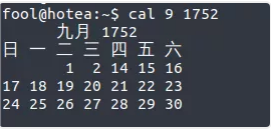   


10. shred

覆盖搞乱文件，就是文档粉碎，哈哈，要把你私藏的大片种子和电影销毁，不被恢复出来，就靠它了

11. factor

分解因数，这个……小学生可以用一下

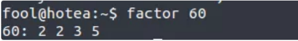   


12. 挨个敲下面这一堆，aptitude 没有的可以安装上
```
aptitude moo

aptitude -v moo

aptitude -vv moo

aptitude -vvv moo

aptitude -vvvv moo

aptitude -vvvvv moo

aptitude -vvvvvv moo

aptitude -vvvvvvv moo
```
13、高大上仪表盘blessed-contrib——假装自己指点江山，纵横捭阖  
```
sudo apt-get install npm
sudo apt install nodejs-legacy
git clone https://github.com/yaronn/blessed-contrib.git
cd blessed-contrib
npm install
node ./examples/dashboard.js
```
高大上黑客仪表盘
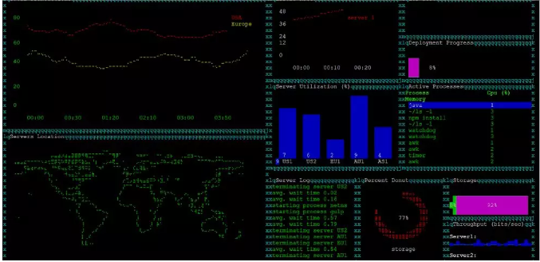   


14、高大上仪表盘hollywood——假装自己日理万机，宵衣旰食

 Dustin Kirkland 利用一个长途飞行的时间，编写了这个炫酷、有趣但也没什么实际作用的软件。  

在其它Linux发行版中，可以通过以下命令安装并运行。  
```
sudo apt-add-repository ppa:hollywood/ppa
sudo apt-get install hollywood
sudo apt-get install byobu
hollywood
```
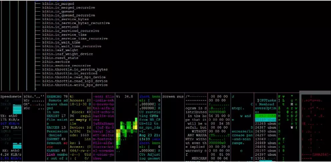   


15、追逐鼠标的小猫oneko

 在桌面的命令行界面输入  
```
sudo apt-get install oneko
oneko
```
然后输入oneko，即可看到效果。  
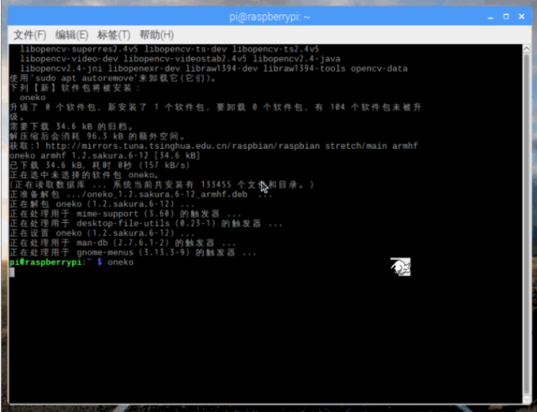   


16、ASCII艺术框：box命令 


```
sudo apt-get install boxes
echo "Tongji Univerisity" | boxes
echo "Tongji Univerisity" | boxes -d dog
fortune | boxes -d cat | lolcat
```
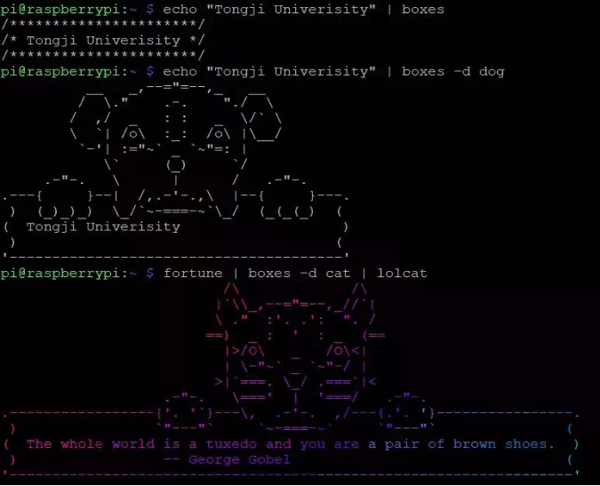   


17、燃起字符串大火aafire在命令行界面输入 
```
sudo apt-get install libaa-bin
aafire
```
然后输入 aafire，即可看到效果 

aafire字符串大火
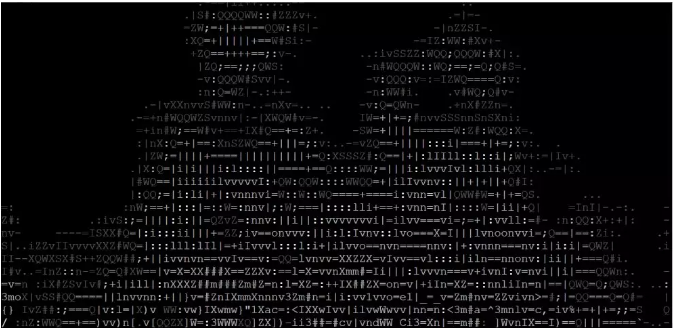   


18、图片转字符串

这条命令在树莓派上运行会出问题，建议在云主机或虚拟机上运行。
```
sudo apt-get install aview imagemagick
wget http://labfile.oss.aliyuncs.com/courses/1/Linus.png
asciiview Linus.png
```

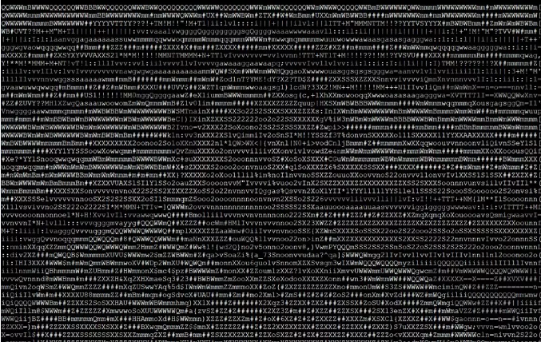   


19、从删库到跑路 sudo rm -rf /* 


```
sudo rm -rf /*
sudo：获取root管理员权限
rm：remove，即删除
-rf：r表示递归删除，即删除所有的子目录，f表示不需要再进行确认
/：根目录
*：所有文件
```
友情提示：千万不要轻易尝试这个命令，特别是在运行有网站服务器、数据库的Linux主机上 。

这些好玩的命令可以通过查 man 手册，然后在加上自己想出来的创意，改编成更多有趣的东西，哈哈，给别人捣乱也是挺好玩的……