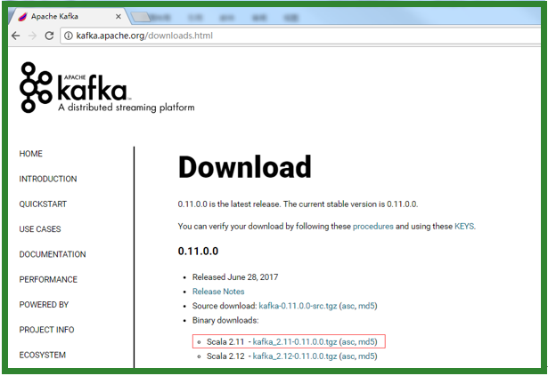

## 【kafka集群部署】
### 【2.1】环境准备
#### 【2.1.1】集群规划
hadoop102---hadoop103---hadoop104       
zk---------------zk---------------zk    
kafka-----------kafka-----------kafka   

#### 【2.1.2】jar包下载
http://kafka.apache.org/downloads.html

#### 【2.2】kafka集群部署
1）解压安装包
        
        [gaozi@hadoop102 software]$ tar -zxvf kafka_2.11-0.11.0.0.tgz -C /opt/module/
2）修改解压后的文件名称
        
        [gaozi@hadoop102 module]$ mv kafka_2.11-0.11.0.0/ kafka
3）在/opt/module/kafka目录下创建logs文件夹
        
        [gaozi@hadoop102 kafka]$ mkdir logs        
4）修改配置文件
        
        [gaozi@hadoop102 kafka]$ cd config/
        [gaozi@hadoop102 config]$ vi server.properties
输入以下内容：
        
        #broker的全局唯一编号，不能重复
        broker.id=0
        #删除topic功能使能
        delete.topic.enable=true
        #处理网络请求的线程数量
        num.network.threads=3
        #用来处理磁盘IO的现成数量
        num.io.threads=8
        #发送套接字的缓冲区大小
        socket.send.buffer.bytes=102400
        #接收套接字的缓冲区大小
        socket.receive.buffer.bytes=102400
        #请求套接字的缓冲区大小
        socket.request.max.bytes=104857600
        #kafka运行日志存放的路径	
        log.dirs=/opt/module/kafka/logs
        #topic在当前broker上的分区个数
        num.partitions=1
        #用来恢复和清理data下数据的线程数量
        num.recovery.threads.per.data.dir=1
        #segment文件保留的最长时间，超时将被删除
        log.retention.hours=168
        #配置连接Zookeeper集群地址
        zookeeper.connect=hadoop102:2181,hadoop103:2181,hadoop104:2181

5）配置环境变量
        
        [gaozi@hadoop102 module]$sudo vi /etc/profile
        
        #KAFKA_HOME
        export KAFKA_HOME=/opt/module/kafka
        export PATH=$PATH:$KAFKA_HOME/bin
        
        [gaozi@hadoop102 module]$ source /etc/profile
6）分发安装包
        
        [gaozi@hadoop102 module]$ xsync kafka/
注意：分发之后记得配置其他机器的环境变量

7）分别在hadoop103和hadoop104上修改配置文件/opt/module/kafka/config/server.properties中的broker.id=1、broker.id=2      
注：broker.id不得重复

8）启动集群
依次在hadoop102、hadoop103、hadoop104节点上启动kafka
        
        [gaozi@hadoop102 kafka]$ bin/kafka-server-start.sh config/server.properties &
        [gaozi@hadoop103 kafka]$ bin/kafka-server-start.sh config/server.properties &
        [gaozi@hadoop104 kafka]$ bin/kafka-server-start.sh config/server.properties &

9）关闭集群
        
        [gaozi@hadoop102 kafka]$ bin/kafka-server-stop.sh stop
        [gaozi@hadoop103 kafka]$ bin/kafka-server-stop.sh stop
        [gaozi@hadoop104 kafka]$ bin/kafka-server-stop.sh stop

