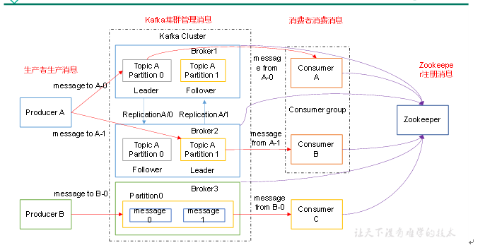
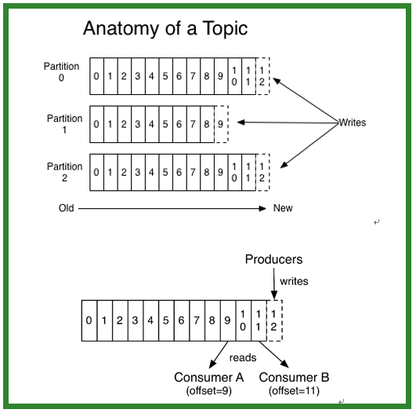

### 【3 - kafka工作流程分析】
kafka核心组成

### 【3.1】kafka生产过程分析
## 【3.1.1】写入方式
>producer采用推（push）模式将消息发布到broker，每条消息都被追加（append）到分区（patition）中，属于顺序写磁盘（顺序写磁盘效率比随机写内存要高，保障kafka吞吐率）。
 
 ## 【3.1.2】分区
>消息发送时都被发送到一个topic，其本质就是一个目录，而topic是由一些Partition Logs(分区日志)组成，其组织结构如下图所示：

