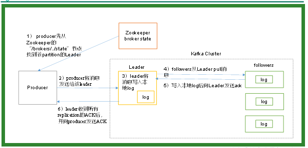
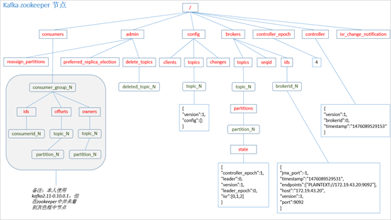
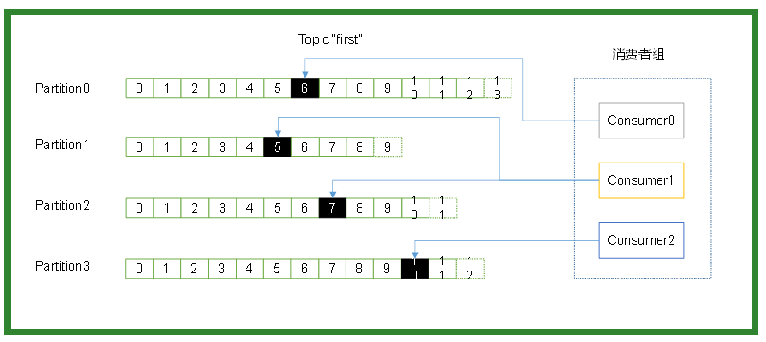

## 【3 - kafka工作流程分析】
kafka核心组成


## 【3.1】kafka生产过程分析
### 【3.1.1】写入方式
>producer采用推（push）模式将消息发布到broker，每条消息都被追加（append）到分区（patition）中，属于顺序写磁盘（顺序写磁盘效率比随机写内存要高，保障kafka吞吐率）。
 
 ### 【3.1.2】分区
>消息发送时都被发送到一个topic，其本质就是一个目录，而topic是由一些Partition Logs(分区日志)组成，其组织结构如下图所示：


我们可以看到，每个Partition中的消息都是有序的，生产的消息被不断追加到Partition log上，其中的每一个消息都被赋予了一个唯一的offset值。

1>分区的原因
 1. 方便在集群中扩展，每个Partition可以通过调整以适应它所在的机器，而一个topic又可以有多个Partition组成，因此整个集群就可以适应任意大小的数据了；
 2. 可以提高并发，因为可以以Partition为单位读写了。

2>分区的原则
1. 指定了patition，则直接使用；
2. 未指定patition但指定key，通过对key的value进行hash出一个patition；
3. patition和key都未指定，使用轮询选出一个patition。
```
DefaultPartitioner类
publicint partition(String topic, Object key, byte[] keyBytes, Object value, byte[] valueBytes, Cluster cluster) {
        List<PartitionInfo> partitions = cluster.partitionsForTopic(topic);
int numPartitions = partitions.size();
if (keyBytes == null) {
int nextValue = nextValue(topic);
         List<PartitionInfo> availablePartitions =cluster.availablePartitionsForTopic(topic);
         if (availablePartitions.size() > 0) {
         int part = Utils.toPositive(nextValue) % availablePartitions.size();
         return availablePartitions.get(part).partition();
                     } else {
                         // no partitions are available, give a non-available partition
         return Utils.toPositive(nextValue) % numPartitions;
                     }
                 } else {
                     // hash the keyBytes to choose a partition
         return Utils.toPositive(Utils.murmur2(keyBytes)) % numPartitions;
                 }
             }
```
 ### 【3.1.3】副本（Replication）
 >同一个partition可能会有多个replication（对应 server.properties 配置中的 default.replication.factor=N）。没有replication的情况下，一旦broker 
 宕机，其上所有 patition 的数据都不可被消费，同时producer也不能再将数据存于其上的patition。引入replication之后，同一个partition可能会有多个replication，而这时需要在这些replication之间选出一个leader，producer和consumer只与这个leader交互，其它replication作为follower从leader 中复制数据。
 
 ### 【3.1.4】写入流程
 producer写入消息流程如下：
 
1）producer先从zookeeper的 "/brokers/.../state"节点找到该partition的leader
2）producer将消息发送给该leader
3）leader将消息写入本地log
4）followers从leader pull消息，写入本地log后向leader发送ACK
5）leader收到所有ISR中的replication的ACK后，增加HW（high watermark，最后commit 的offset）并向producer发送ACK

## 【3.2】Broker 保存消息
### 【3.2.1 存储方式】
物理上把topic分成一个或多个patition（对应 server.properties 中的num.partitions=3配置），每个patition物理上对应一个文件夹（该文件夹存储该patition的所有消息和索引文件），如下：
```
[gaozi@hadoop102 logs]$ ll
drwxrwxr-x. 2 atguigu atguigu  4096 8月   6 14:37 first-0
drwxrwxr-x. 2 atguigu atguigu  4096 8月   6 14:35 first-1
drwxrwxr-x. 2 atguigu atguigu  4096 8月   6 14:37 first-2
[gaozi@hadoop102 logs]$ cd first-0
[gaozi@hadoop102 first-0]$ ll
-rw-rw-r--. 1 atguigu atguigu 10485760 8月   6 14:33 00000000000000000000.index
-rw-rw-r--. 1 atguigu atguigu      219 8月   6 15:07 00000000000000000000.log
-rw-rw-r--. 1 atguigu atguigu 10485756 8月   6 14:33 00000000000000000000.timeindex
-rw-rw-r--. 1 atguigu atguigu        8 8月   6 14:37 leader-epoch-checkpoint
```
### 【3.2.2 存储策略】
无论消息是否被消费，kafka都会保留所有消息。有两种策略可以删除旧数据：
- 1）基于时间：log.retention.hours=168      
- 2）基于大小：log.retention.bytes=1073741824       
需要注意的是，因为Kafka读取特定消息的时间复杂度为O(1)，即与文件大小无关，所以这里删除过期文件与提高 Kafka 性能无关。

### 【3.2.3 存储结构】

注意：producer不在zk中注册，消费者在zk中注册。

## 【3.3 kafka消费过程分析】
kafka提供了两套consumer API：高级Consumer API和低级Consumer API。

### 【3.3.1 高级API】
1）高级API优点            
- 高级API 写起来简单     
- 不需要自行去管理offset，系统通过zookeeper自行管理。       
- 不需要管理分区，副本等情况，.系统自动管理。      
- 消费者断线会自动根据上一次记录在zookeeper中的offset去接着获取数据（默认设置1分钟更新一下zookeeper中存的offset）
- 可以使用group来区分对同一个topic 的不同程序访问分离开来（不同的group记录不同的offset，这样不同程序读取同一个topic才不会因为offset互相影响）
2）高级API缺点       
- 不能自行控制offset（对于某些特殊需求来说）
- 不能细化控制如分区、副本、zk等


### 【3.3.2 低级API】
1）低级 API 优点     
- 能够让开发者自己控制offset，想从哪里读取就从哪里读取。
- 自行控制连接分区，对分区自定义进行负载均衡
- 对zookeeper的依赖性降低（如：offset不一定非要靠zk存储，自行存储offset即可，比如存在文件或者内存中）     
2）低级API缺点       
太过复杂，需要自行控制offset，连接哪个分区，找到分区leader 等。

### 【3.3.3 消费者组】

- 消费者是以consumer group消费者组的方式工作，由一个或者多个消费者组成一个组，共同消费一个topic。每个分区在同一时间只能由group中的一个消费者读取，但是多个group可以同时消费这个partition。在图中，有一个由三个消费者组成的group，有一个消费者读取主题中的两个分区，另外两个分别读取一个分区。某个消费者读取某个分区，也可以叫做某个消费者是某个分区的拥有者。
- 在这种情况下，消费者可以通过水平扩展的方式同时读取大量的消息。另外，如果一个消费者失败了，那么其他的group成员会自动负载均衡读取之前失败的消费者读取的分区。

### 【3.3.4 消费方式】
consumer采用pull（拉）模式从broker中读取数据。        
- push（推）模式很难适应消费速率不同的消费者，因为消息发送速率是由broker决定的。它的目标是尽可能以最快速度传递消息，但是这样很容易造成consumer来不及处理消息，典型的表现就是拒绝服务以及网络拥塞。而pull
模式则可以根据consumer的消费能力以适当的速率消费消息。
- 对于Kafka而言，pull模式更合适，它可简化broker的设计，consumer可自主控制消费消息的速率，同时consumer可以自己控制消费方式——即可批量消费也可逐条消费，同时还能选择不同的提交方式从而实现不同的传输语义。
- pull模式不足之处是，如果kafka没有数据，消费者可能会陷入循环中，一直等待数据到达。为了避免这种情况，我们在我们的拉请求中有参数，允许消费者请求在等待数据到达的“长轮询”中进行阻塞（并且可选地等待到给定的字节数，以确保大的传输大小）。

### 【3.3.5 消费者组案例】
1）需求：测试同一个消费者组中的消费者，同一时刻只能有一个消费者消费。     
2）案例实操
(1) 在hadoop102、hadoop103上修改/opt/module/kafka/config/consumer.properties配置文件中的group.id属性为任意组名。
```
[gaozi@hadoop103 config]$ vi consumer.properties
group.id=gaozi
```
（2）在hadoop102、hadoop103上分别启动消费者     
```
[gaozi@hadoop102 kafka]$ bin/kafka-console-consumer.sh \
--zookeeper hadoop102:2181 --topic first --consumer.config config/consumer.properties
[gaozi@hadoop103 kafka]$ bin/kafka-console-consumer.sh --zookeeper hadoop102:2181 --topic first --consumer.config 
config/consumer.properties
```
（3）在hadoop104上启动生产者
```
[gaozi@hadoop104 kafka]$ bin/kafka-console-producer.sh \
--broker-list hadoop102:9092 --topic first
>hello world
```
（4）查看hadoop102和hadoop103的接收者。
```
同一时刻只有一个消费者接收到消息。
```