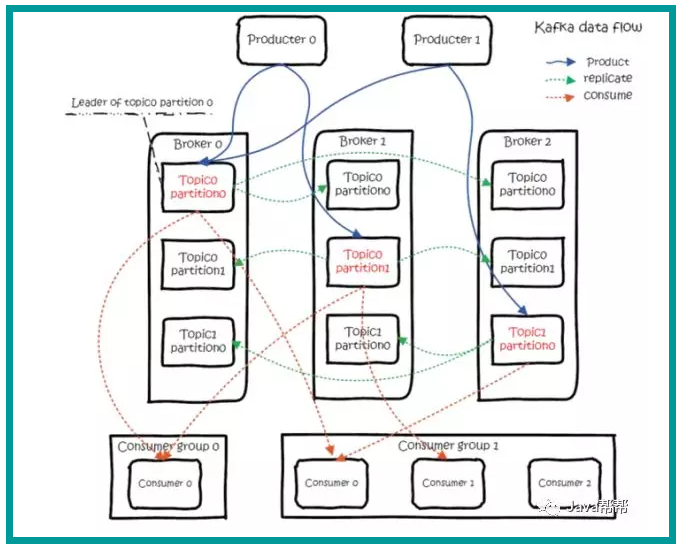

### 【Kafka】

#### 【01 - 简介】
>Kafka 是一个分布式消息队列，具有高性能、持久化、多副本备份、横向扩展能力。生产者往队列里写消息，消费者从队列里取消息进行业务逻辑。一般在架构设计中起到解耦、削峰、异步处理的作用。

>Kafka 对外使用 Topic 的概念，生产者往 Topic 里写消息，消费者从中读消息。

>为了做到水平扩展，一个 Topic 实际是由多个 Partition 组成的，遇到瓶颈时，可以通过增加 Partition 的数量来进行横向扩容。单个 Parition 内是保证消息有序。
 
>每新写一条消息，Kafka 就是在对应的文件 append 写，所以性能非常高。

Kafka 的总体数据流是这样的：
   

