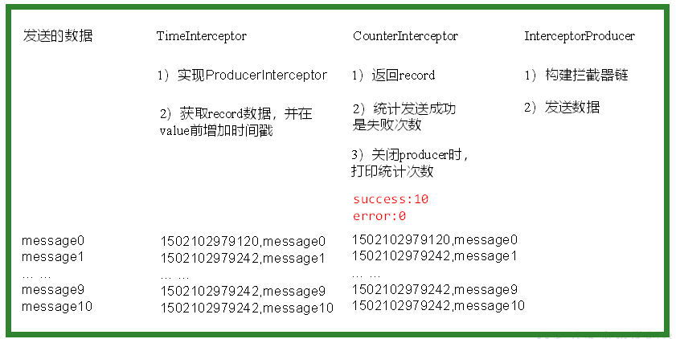

## 【kafka拦截器】
### 【5.1 kafka拦截器原理】
- Producer拦截器(interceptor)是在Kafka 0.10版本被引入的，主要用于实现clients端的定制化控制逻辑。

- 对于producer而言，interceptor使得用户在消息发送前以及producer回调逻辑前有机会对消息做一些定制化需求，比如修改消息等。同时，producer允许用户指定多个interceptor按序作用于同一条消息从而形成一个拦截链(interceptor chain)。Intercetpor的实现接口是org.apache.kafka.clients.producer.ProducerInterceptor，其定义的方法包括：
（1）configure(configs)       
获取配置信息和初始化数据时调用。
（2）onSend(ProducerRecord)：      
该方法封装进KafkaProducer.send方法中，即它运行在用户主线程中。Producer确保在消息被序列化以及计算分区前调用该方法。用户可以在该方法中对消息做任何操作，但最好保证不要修改消息所属的topic和分区，否则会影响目标分区的计算     
（3）onAcknowledgement(RecordMetadata, Exception)：        
该方法会在消息被应答或消息发送失败时调用，并且通常都是在producer回调逻辑触发之前。onAcknowledgement运行在producer的IO线程中，因此不要在该方法中放入很重的逻辑，否则会拖慢producer的消息发送效率
（4）close：
关闭interceptor，主要用于执行一些资源清理工作        
如前所述，interceptor可能被运行在多个线程中，因此在具体实现时用户需要自行确保线程安全。另外倘若指定了多个interceptor，则producer将按照指定顺序调用它们，并仅仅是捕获每个interceptor可能抛出的异常记录到错误日志中而非在向上传递。这在使用过程中要特别留意。

### 【5.2 拦截器案例】
>1）需求：       

实现一个简单的双interceptor组成的拦截链。第一个interceptor会在消息发送前将时间戳信息加到消息value的最前部；第二个interceptor会在消息发送后更新成功发送消息数或失败发送消息数。



>2)案例实操：        

（1）增加时间戳拦截器
```java
package com.gaozi.kafka.interceptor;
import java.util.Map;
import org.apache.kafka.clients.producer.ProducerInterceptor;
import org.apache.kafka.clients.producer.ProducerRecord;
import org.apache.kafka.clients.producer.RecordMetadata;

public class TimeInterceptor implements ProducerInterceptor<String, String> {

	@Override
	public void configure(Map<String, ?> configs) {

	}

	@Override
	public ProducerRecord<String, String> onSend(ProducerRecord<String, String> record) {
		// 创建一个新的record，把时间戳写入消息体的最前部
		return new ProducerRecord(record.topic(), record.partition(), record.timestamp(), record.key(),
				System.currentTimeMillis() + "," + record.value().toString());
	}

	@Override
	public void onAcknowledgement(RecordMetadata metadata, Exception exception) {

	}

	@Override
	public void close() {

	}
}

```

2）统计发送消息成功和发送失败消息数，并在producer关闭时打印这两个计数器
```java
package com.gaozi.kafka.interceptor;
import java.util.Map;
import org.apache.kafka.clients.producer.ProducerInterceptor;
import org.apache.kafka.clients.producer.ProducerRecord;
import org.apache.kafka.clients.producer.RecordMetadata;

public class CounterInterceptor implements ProducerInterceptor<String, String>{
    private int errorCounter = 0;
    private int successCounter = 0;

	@Override
	public void configure(Map<String, ?> configs) {
		
	}

	@Override
	public ProducerRecord<String, String> onSend(ProducerRecord<String, String> record) {
		 return record;
	}

	@Override
	public void onAcknowledgement(RecordMetadata metadata, Exception exception) {
		// 统计成功和失败的次数
        if (exception == null) {
            successCounter++;
        } else {
            errorCounter++;
        }
	}

	@Override
	public void close() {
        // 保存结果
        System.out.println("Successful sent: " + successCounter);
        System.out.println("Failed sent: " + errorCounter);
	}
}

```

（3）producer主程序      
```java
package com.gaozi.kafka.interceptor;
import java.util.ArrayList;
import java.util.List;
import java.util.Properties;
import org.apache.kafka.clients.producer.KafkaProducer;
import org.apache.kafka.clients.producer.Producer;
import org.apache.kafka.clients.producer.ProducerConfig;
import org.apache.kafka.clients.producer.ProducerRecord;

public class InterceptorProducer {

	public static void main(String[] args) throws Exception {
		// 1 设置配置信息
		Properties props = new Properties();
		props.put("bootstrap.servers", "hadoop102:9092");
		props.put("acks", "all");
		props.put("retries", 0);
		props.put("batch.size", 16384);
		props.put("linger.ms", 1);
		props.put("buffer.memory", 33554432);
		props.put("key.serializer", "org.apache.kafka.common.serialization.StringSerializer");
		props.put("value.serializer", "org.apache.kafka.common.serialization.StringSerializer");
		
		// 2 构建拦截链
		List<String> interceptors = new ArrayList<>();
		interceptors.add("com.gaozi.kafka.interceptor.TimeInterceptor"); 	interceptors.add("com.gaozi.kafka.interceptor.CounterInterceptor"); 
		props.put(ProducerConfig.INTERCEPTOR_CLASSES_CONFIG, interceptors);
		
		String topic = "first";
		Producer<String, String> producer = new KafkaProducer<>(props);
		
		// 3 发送消息
		for (int i = 0; i < 10; i++) {
			
		    ProducerRecord<String, String> record = new ProducerRecord<>(topic, "message" + i);
		    producer.send(record);
		}
		
		// 4 一定要关闭producer，这样才会调用interceptor的close方法
		producer.close();
	}
}

```

>3）测试

（1）在kafka上启动消费者，然后运行客户端java程序。
```
[gaozi@hadoop102 kafka]$ bin/kafka-console-consumer.sh \
--zookeeper hadoop102:2181 --from-beginning --topic first

1501904047034,message0
1501904047225,message1
1501904047230,message2
1501904047234,message3
1501904047236,message4
1501904047240,message5
1501904047243,message6
1501904047246,message7
1501904047249,message8
1501904047252,message9

```
（2）观察java平台控制台输出数据如下：       
```
Successful sent: 10
Failed sent: 0
```
