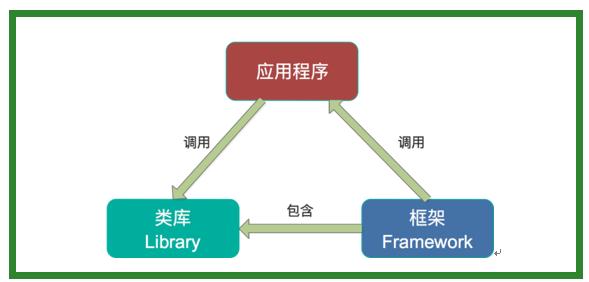
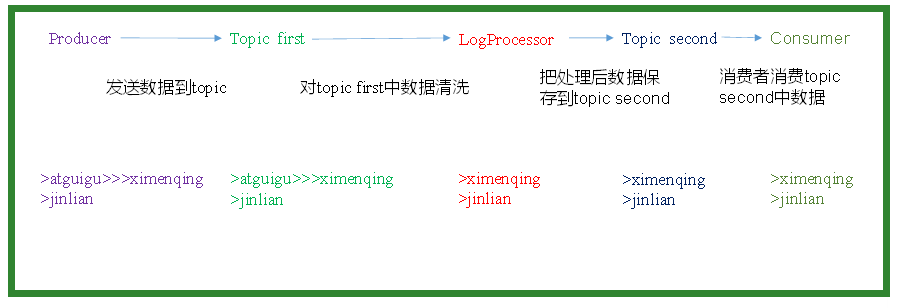

## 【kafka stream】

## 【6.1 概述】
### 【6.1.1 kafka Streams】
>Kafka Streams。Apache Kafka开源项目的一个组成部分。是一个功能强大，易于使用的库。用于在Kafka上构建高可分布式、拓展性，容错的应用程序。

### 【6.1.2 Kafka Streams特点】
1）功能强大 
高扩展性，弹性，容错 

2）轻量级 
无需专门的集群 
一个库，而不是框架

3）完全集成 
100%的Kafka 0.10.0版本兼容
易于集成到现有的应用程序 

4）实时性
毫秒级延迟 
并非微批处理 
窗口允许乱序数据 
允许迟到数据

### 【6.1.3 为什么要有Kafka Stream】
>当前已经有非常多的流式处理系统，最知名且应用最多的开源流式处理系统有Spark Streaming和Apache Storm。Apache Storm发展多年，应用广泛，提供记录级别的处理能力，当前也支持SQL on 
Stream。而Spark Streaming基于Apache Spark，可以非常方便与图计算，SQL处理等集成，功能强大，对于熟悉其它Spark应用开发的用户而言使用门槛低。另外，目前主流的Hadoop发行版，如Cloudera和Hortonworks，都集成了Apache Storm和Apache Spark，使得部署更容易。        

>既然Apache Spark与Apache Storm拥用如此多的优势，那为何还需要Kafka Stream呢？主要有如下原因。        

- 第一，Spark和Storm都是流式处理框架，而Kafka 
Stream提供的是一个基于Kafka的流式处理类库。框架要求开发者按照特定的方式去开发逻辑部分，供框架调用。开发者很难了解框架的具体运行方式，从而使得调试成本高，并且使用受限。而Kafka Stream作为流式处理类库，直接提供具体的类给开发者调用，整个应用的运行方式主要由开发者控制，方便使用和调试。
       
        
        
- 第二，虽然Cloudera与Hortonworks方便了Storm和Spark的部署，但是这些框架的部署仍然相对复杂。而Kafka Stream作为类库，可以非常方便的嵌入应用程序中，它对应用的打包和部署基本没有任何要求。       

- 第三，就流式处理系统而言，基本都支持Kafka作为数据源。例如Storm具有专门的kafka-spout，而Spark也提供专门的spark-streaming-kafka模块。事实上，Kafka基本上是主流的流式处理系统的标准数据源。换言之，大部分流式系统中都已部署了Kafka，此时使用Kafka Stream的成本非常低。  

- 第四，使用Storm或Spark Streaming时，需要为框架本身的进程预留资源，如Storm的supervisor和Spark on YARN的node manager。即使对于应用实例而言，框架本身也会占用部分资源，如Spark Streaming需要为shuffle和storage预留内存。但是Kafka作为类库不占用系统资源。

- 第五，由于Kafka本身提供数据持久化，因此Kafka Stream提供滚动部署和滚动升级以及重新计算的能力。

- 第六，由于Kafka Consumer Rebalance机制，Kafka Stream可以在线动态调整并行度。  

### 【6.2 数据清洗案例】
0）需求：       
	实时处理单词带有”>>>”前缀的内容。例如输入”gaozi>>>ximenqing”，最终处理成“ximenqing”

1）需求分析：     


2）案例实操:     

（1）创建一个工程，并添加jar包
（2）创建主类

```java
package com.gaozi.kafka.stream;
import java.util.Properties;
import org.apache.kafka.streams.KafkaStreams;
import org.apache.kafka.streams.StreamsConfig;
import org.apache.kafka.streams.processor.Processor;
import org.apache.kafka.streams.processor.ProcessorSupplier;
import org.apache.kafka.streams.processor.TopologyBuilder;

public class Application {

	public static void main(String[] args) {

		// 定义输入的topic
        String from = "first";
        // 定义输出的topic
        String to = "second";

        // 设置参数
        Properties settings = new Properties();
        settings.put(StreamsConfig.APPLICATION_ID_CONFIG, "logFilter");
        settings.put(StreamsConfig.BOOTSTRAP_SERVERS_CONFIG, "hadoop102:9092");

        StreamsConfig config = new StreamsConfig(settings);

        // 构建拓扑
        TopologyBuilder builder = new TopologyBuilder();

        builder.addSource("SOURCE", from)
               .addProcessor("PROCESS", new ProcessorSupplier<byte[], byte[]>() {

					@Override
					public Processor<byte[], byte[]> get() {
						// 具体分析处理
						return new LogProcessor();
					}
				}, "SOURCE")
                .addSink("SINK", to, "PROCESS");

        // 创建kafka stream
        KafkaStreams streams = new KafkaStreams(builder, config);
        streams.start();
	}
}

```
(3)具体业务处理
```java
package com.gaozi.kafka.stream;
import org.apache.kafka.streams.processor.Processor;
import org.apache.kafka.streams.processor.ProcessorContext;

public class LogProcessor implements Processor<byte[], byte[]> {
	
	private ProcessorContext context;
	
	@Override
	public void init(ProcessorContext context) {
		this.context = context;
	}

	@Override
	public void process(byte[] key, byte[] value) {
		String input = new String(value);
		
		// 如果包含“>>>”则只保留该标记后面的内容
		if (input.contains(">>>")) {
			input = input.split(">>>")[1].trim();
			// 输出到下一个topic
			context.forward("logProcessor".getBytes(), input.getBytes());
		}else{
			context.forward("logProcessor".getBytes(), input.getBytes());
		}
	}

	@Override
	public void punctuate(long timestamp) {
		
	}

	@Override
	public void close() {
		
	}
}

```

（4）运行程序

（5）在hadoop104上启动生产者
```
[gaozi@hadoop104 kafka]$ bin/kafka-console-producer.sh \
--broker-list hadoop102:9092 --topic first

>hello>>>world
>h>>>gaozi
>hahaha

```

（6）在hadoop103上启动消费者
```
[gaozi@hadoop103 kafka]$ bin/kafka-console-consumer.sh \
--zookeeper hadoop102:2181 --from-beginning --topic second

world
gaozi
hahaha

```


