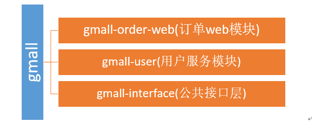

### 【分布式基础理论】

### 【一、基础理论】
### 【1、分布式基础理论】
### 【1.1 什么是分布式系统？】
>《分布式系统原理与范型》定义：
“分布式系统是若干独立计算机的集合，这些计算机对于用户来说就像单个相关系统”
分布式系统（distributed system）是建立在网络之上的软件系统。

随着互联网的发展，网站应用的规模不断扩大，常规的垂直应用架构已无法应对，分布式服务架构以及流动计算架构势在必行，亟需一个治理系统确保架构有条不紊的演进。

### 【1.2 发展演变】


- 单一应用架构      
当网站流量很小时，只需一个应用，将所有功能都部署在一起，以减少部署节点和成本。此时，用于简化增删改查工作量的数据访问框架(ORM)是关键。

适用于小型网站，小型管理系统，将所有功能都部署到一个功能里，简单易用。
缺点： 1、性能扩展比较难       
       2、协同开发问题     
       3、不利于升级维护

- 垂直应用架构
> 当访问量逐渐增大，单一应用增加机器带来的加速度越来越小，将应用拆成互不相干的几个应用，以提升效率。此时，用于加速前端页面开发的Web框架(MVC)是关键。


通过切分业务来实现各个模块独立部署，降低了维护和部署的难度，团队各司其职更易管理，性能扩展也更方便，更有针对性。

缺点： 公用模块无法重复利用，开发性的浪费

- 分布式服务架构
当垂直应用越来越多，应用之间交互不可避免，将核心业务抽取出来，作为独立的服务，逐渐形成稳定的服务中心，使前端应用能更快速的响应多变的市场需求。此时，用于提高业务复用及整合的分布式服务框架(RPC)是关键。


- 流动计算架构
当服务越来越多，容量的评估，小服务资源的浪费等问题逐渐显现，此时需增加一个调度中心基于访问压力实时管理集群容量，提高集群利用率。此时，用于提高机器利用率的资源调度和治理中心(SOA)[ Service Oriented Architecture]是关键。


### 【1.3 RPC】
#### 【1.3.1 什么是RPC】
RPC【Remote Procedure Call】是指远程过程调用，是一种进程间通信方式，他是一种技术的思想，而不是规范。它允许程序调用另一个地址空间（通常是共享网络的另一台机器上）的过程或函数，而不用程序员显式编码这个远程调用的细节。即程序员无论是调用本地的还是远程的函数，本质上编写的调用代码基本相同。

#### 【1.3.2 RPC基本原理】


RPC两个核心模块：通讯，序列化。


### 【2、dubbo核心概念】
#### 【2.1 简介】
Apache Dubbo (incubating) |ˈdʌbəʊ| 是一款高性能、轻量级的开源Java RPC框架，它提供了三大核心能力：面向接口的远程方法调用，智能容错和负载均衡，以及服务自动注册和发现。        
官网：
http://dubbo.apache.org/
#### 【2.1 基本概念】


> 服务提供者（Provider）：暴露服务的服务提供方，服务提供者在启动时，向注册中心注册自己提供的服务。

> 服务消费者（Consumer）: 调用远程服务的服务消费方，服务消费者在启动时，向注册中心订阅自己所需的服务，服务消费者，从提供者地址列表中，基于软负载均衡算法，选一台提供者进行调用，如果调用失败，再选另一台调用。   

> 注册中心（Registry）：注册中心返回服务提供者地址列表给消费者，如果有变更，注册中心将基于长连接推送变更数据给消费者     

>监控中心（Monitor）：服务消费者和提供者，在内存中累计调用次数和调用时间，定时每分钟发送一次统计数据到监控中心

----调用关系说明----
- 	服务容器负责启动，加载，运行服务提供者。
- 	服务提供者在启动时，向注册中心注册自己提供的服务。
- 	服务消费者在启动时，向注册中心订阅自己所需的服务。
- 	注册中心返回服务提供者地址列表给消费者，如果有变更，注册中心将基于长连接推送变更数据给消费者。
- 	服务消费者，从提供者地址列表中，基于软负载均衡算法，选一台提供者进行调用，如果调用失败，再选另一台调用。
- 	服务消费者和提供者，在内存中累计调用次数和调用时间，定时每分钟发送一次统计数据到监控中心。

### 【3、dubbo环境搭建】
#### 【3.1 windows-安装zookeeper】
```
1、下载zookeeper
网址 https://archive.apache.org/dist/zookeeper/zookeeper-3.4.13/ 

2、解压zookeeper
解压运行zkServer.cmd ，初次运行会报错，没有zoo.cfg配置文件

3、修改zoo.cfg配置文件
将conf下的zoo_sample.cfg复制一份改名为zoo.cfg即可。
注意几个重要位置：
dataDir=./   临时数据存储的目录（可写相对路径）
clientPort=2181   zookeeper的端口号
修改完成后再次启动zookeeper

4、使用zkCli.cmd测试
ls /：列出zookeeper根下保存的所有节点
create –e /gaozi 123：创建一个gaozi节点，值为123
get /gaozi：获取/gaozi节点的值
```
        

【windows】-安装dubbo-admin管理控制台    
dubbo本身并不是一个服务软件。它其实就是一个jar包能够帮你的java程序连接到zookeeper，并利用zookeeper消费、提供服务。所以你不用在Linux上启动什么dubbo服务。
但是为了让用户更好的管理监控众多的dubbo服务，官方提供了一个可视化的监控程序，不过这个监控即使不装也不影响使用。
```
1、下载dubbo-admin
https://github.com/apache/incubator-dubbo-ops 

2、进入目录，修改dubbo-admin配置
修改 src\main\resources\application.properties 指定zookeeper地址

3、打包dubbo-admin
mvn clean package -Dmaven.test.skip=true 

4、运行dubbo-admin
java -jar dubbo-admin-0.0.1-SNAPSHOT.jar

5、打开浏览器（默认使用root/root登录）
```


#### 【3.3 linux-安装zookeeper】
1、安装jdk
```
1、下载jdk
http://www.oracle.com/technetwork/java/javase/downloads/jdk8-downloads-2133151.html
 
不要使用wget命令获取jdk链接，这是默认不同意，导致下载来的jdk压缩内容错误

2、上传到服务器并解压
 
3、设置环境变量
/usr/local/java/jdk1.8.0_171
 
文件末尾加入下面配置
export JAVA_HOME=/usr/local/java/jdk1.8.0_171
export JRE_HOME=${JAVA_HOME}/jre
export CLASSPATH=.:${JAVA_HOME}/lib:${JRE_HOME}/lib
export PATH=${JAVA_HOME}/bin:$PATH
 
4、使环境变量生效&测试JDK
 

```
2、安装zookeeper
```
1、下载zookeeper
网址 https://archive.apache.org/dist/zookeeper/zookeeper-3.4.11/ 
wget https://archive.apache.org/dist/zookeeper/zookeeper-3.4.11/zookeeper-3.4.11.tar.gz  
2、解压
 
3、移动到指定位置并改名为zookeeper
 
```
 
3、开机启动zookeeper
```
1）-复制如下脚本
#!/bin/bash
#chkconfig:2345 20 90
#description:zookeeper
#processname:zookeeper
ZK_PATH=/usr/local/zookeeper
export JAVA_HOME=/usr/local/java/jdk1.8.0_171
case $1 in
         start) sh  $ZK_PATH/bin/zkServer.sh start;;
         stop)  sh  $ZK_PATH/bin/zkServer.sh stop;;
         status) sh  $ZK_PATH/bin/zkServer.sh status;;
         restart) sh $ZK_PATH/bin/zkServer.sh restart;;
         *)  echo "require start|stop|status|restart"  ;;
esac

2）-把脚本注册为Service
chkconfig --add zookeeper
chkconfig --list 

3）-增加权限
chmod +x /etc/init.d/zookeeper 
```

4、配置zookeeper
```
1、初始化zookeeper配置文件
拷贝/usr/local/zookeeper/conf/zoo_sample.cfg   
到同一个目录下改个名字叫zoo.cfg
 


2、启动zookeeper
service zookeeper start 

```
#### 【3.4 linux-安装dubbo-admin】
1、安装Tomcat8（旧版dubbo-admin是war，新版是jar不需要安装Tomcat）        
```
1、下载Tomcat8并解压
https://tomcat.apache.org/download-80.cgi
wget http://mirrors.shu.edu.cn/apache/tomcat/tomcat-8/v8.5.32/bin/apache-tomcat-8.5.32.tar.gz
2、解压移动到指定位置
 
3、开机启动tomcat8
 
复制如下脚本
#!/bin/bash
#chkconfig:2345 21 90
#description:apache-tomcat-8
#processname:apache-tomcat-8
CATALANA_HOME=/opt/apache-tomcat-8.5.32
export JAVA_HOME=/opt/java/jdk1.8.0_171
case $1 in
start)
    echo "Starting Tomcat..."  
    $CATALANA_HOME/bin/startup.sh
    ;;

stop)
    echo "Stopping Tomcat..."  
    $CATALANA_HOME/bin/shutdown.sh
    ;;

restart)
    echo "Stopping Tomcat..."  
    $CATALANA_HOME/bin/shutdown.sh
    sleep 2
    echo  
    echo "Starting Tomcat..."  
    $CATALANA_HOME/bin/startup.sh
    ;;
*)
    echo "Usage: tomcat {start|stop|restart}"  
    ;; esac

4、注册服务&添加权限
 
 
5、启动服务&访问tomcat测试
```

2、安装dubbo-admin
dubbo本身并不是一个服务软件。它其实就是一个jar包能够帮你的java程序连接到zookeeper，并利用zookeeper消费、提供服务。所以你不用在Linux上启动什么dubbo服务。
但是为了让用户更好的管理监控众多的dubbo服务，官方提供了一个可视化的监控程序，不过这个监控即使不装也不影响使用。
```
1、下载dubbo-admin
https://github.com/apache/incubator-dubbo-ops 
 

2、进入目录，修改dubbo-admin配置
修改 src\main\resources\application.properties 指定zookeeper地址
 
3、打包dubbo-admin
mvn clean package -Dmaven.test.skip=true 

4、运行dubbo-admin
java -jar dubbo-admin-0.0.1-SNAPSHOT.jar
默认使用root/root 登陆
 
```


### 【4、dubbo hello world】
#### 【4.1 提出需求】
某个电商系统，订单服务需要调用用户服务获取某个用户的所有地址；
我们现在 需要创建两个服务模块进行测试 

模块     | 功能
-------- | ---
订单服务web模块 | 创建订单等
用户服务service模块    | 查询用户地址等

测试预期结果：
订单服务web模块在A服务器，用户服务模块在B服务器，A可以远程调用B的功能。

#### 【4.2 工程架构】
根据 dubbo《服务化最佳实践》       
1、分包
建议将服务接口，服务模型，服务异常等均放在 API 包中，因为服务模型及异常也是 API 的一部分，同时，这样做也符合分包原则：重用发布等价原则(REP)，共同重用原则(CRP)。      
如果需要，也可以考虑在 API 包中放置一份 spring 的引用配置，这样使用方，只需在 spring 加载过程中引用此配置即可，配置建议放在模块的包目录下，以免冲突，如：com/alibaba/china/xxx/dubbo-reference.xml。       

2、粒度
- 服务接口尽可能大粒度，每个服务方法应代表一个功能，而不是某功能的一个步骤，否则将面临分布式事务问题，Dubbo 暂未提供分布式事务支持。        
- 服务接口建议以业务场景为单位划分，并对相近业务做抽象，防止接口数量爆炸。        
- 不建议使用过于抽象的通用接口，如：Map query(Map)，这样的接口没有明确语义，会给后期维护带来不便。


#### 【4.3 创建模块】
1、gmall-interface：公共接口层（model，service，exception…）
```
作用：定义公共接口，也可以导入公共依赖

1、Bean模型
public class UserAddress implements Serializable{
    private Integer id;
    private String userAddress;
    private String userId;
    private String consignee;
    private String phoneNum;
    private String isDefault;
}

2、Service接口
UserService
public List<UserAddress> getUserAddressList(String userId)

```

2、gmall-user：用户模块（对用户接口的实现）
```
1、pom.xml
  <dependencies>
  	<dependency>
  		<groupId>com.gaozi.dubbo</groupId>
  		<artifactId>gmall-interface</artifactId>
  		<version>0.0.1-SNAPSHOT</version>
  	</dependency>
  </dependencies>
  
2、Service
public class UserServiceImpl implements UserService {
		
	@Override
	public List<UserAddress> getUserAddressList(String userId) {
		// TODO Auto-generated method stub
		return userAddressDao.getUserAddressById(userId);
	}

}

```

3、gmall-order-web：订单模块（调用用户模块）
```
1、pom.xml
<dependencies>
  	<dependency>
  		<groupId>com.gaozi.dubbo</groupId>
  		<artifactId>gmall-interface</artifactId>
  		<version>0.0.1-SNAPSHOT</version>
  	</dependency>
   </dependencies>
   
2、测试
public class OrderService {
	
	UserService userService;
	
	/**
	 * 初始化订单，查询用户的所有地址并返回
	 * @param userId
	 * @return
	 */
	public List<UserAddress> initOrder(String userId){
		return userService.getUserAddressList(userId);
	}

}

```
现在这样是无法进行调用的。我们gmall-order-web引入了gmall-interface，但是interface的实现是gmall-user，我们并没有引入，而且实际他可能还在别的服务器中。     

#### 【4.4 使用dubbo改造】
1、改造gmall-user作为服务提供者
```
1、引入dubbo
		<!-- 引入dubbo -->
		<dependency>
			<groupId>com.alibaba</groupId>
			<artifactId>dubbo</artifactId>
			<version>2.6.2</version>
		</dependency>
	<!-- 由于我们使用zookeeper作为注册中心，所以需要操作zookeeper
dubbo 2.6以前的版本引入zkclient操作zookeeper 
dubbo 2.6及以后的版本引入curator操作zookeeper
下面两个zk客户端根据dubbo版本2选1即可
-->
		<dependency>
			<groupId>com.101tec</groupId>
			<artifactId>zkclient</artifactId>
			<version>0.10</version>
		</dependency>
		<!-- curator-framework -->
		<dependency>
			<groupId>org.apache.curator</groupId>
			<artifactId>curator-framework</artifactId>
			<version>2.12.0</version>
		</dependency>

2、配置提供者
<!--当前应用的名字  -->
	<dubbo:application name="gmall-user"></dubbo:application>
	<!--指定注册中心的地址  -->
    <dubbo:registry address="zookeeper://118.24.44.169:2181" />
    <!--使用dubbo协议，将服务暴露在20880端口  -->
    <dubbo:protocol name="dubbo" port="20880" />
    <!-- 指定需要暴露的服务 -->
    <dubbo:service interface="com.gaozi.gmall.service.UserService" ref="userServiceImpl" />
3、启动服务
	public static void main(String[] args) throws IOException {
		ClassPathXmlApplicationContext context = 
				new ClassPathXmlApplicationContext("classpath:spring-beans.xml");
		
		System.in.read(); 
	}
```
2、改造gmall-order-web作为服务消费者
```
1、引入dubbo
		<!-- 引入dubbo -->
		<dependency>
			<groupId>com.alibaba</groupId>
			<artifactId>dubbo</artifactId>
			<version>2.6.2</version>
		</dependency>
	<!-- 由于我们使用zookeeper作为注册中心，所以需要引入zkclient和curator操作zookeeper -->
		<dependency>
			<groupId>com.101tec</groupId>
			<artifactId>zkclient</artifactId>
			<version>0.10</version>
		</dependency>
		<!-- curator-framework -->
		<dependency>
			<groupId>org.apache.curator</groupId>
			<artifactId>curator-framework</artifactId>
			<version>2.12.0</version>
		</dependency>

2、配置消费者信息
<!-- 应用名 -->
	<dubbo:application name="gmall-order-web"></dubbo:application>
	<!-- 指定注册中心地址 -->
	<dubbo:registry address="zookeeper://118.24.44.169:2181" />
	<!-- 生成远程服务代理，可以和本地bean一样使用demoService -->
	<dubbo:reference id="userService" interface="com.gaozi.gmall.service.UserService"></dubbo:reference>

```

3、测试调用
访问gmall-order-web的initOrder请求，会调用UserService获取用户地址；
调用成功。说明我们order已经可以调用远程的UserService了；


4、注解版
```
1、服务提供方
	<dubbo:application name="gmall-user"></dubbo:application>
    <dubbo:registry address="zookeeper://118.24.44.169:2181" />
    <dubbo:protocol name="dubbo" port="20880" />
<dubbo:annotation package="com.gaozi.gmall.user.impl"/>
import com.alibaba.dubbo.config.annotation.Service;
import com.gaozi.gmall.bean.UserAddress;
import com.gaozi.gmall.service.UserService;
import com.gaozi.gmall.user.mapper.UserAddressMapper;

@Service //使用dubbo提供的service注解，注册暴露服务
public class UserServiceImpl implements UserService {

	@Autowired
	UserAddressMapper userAddressMapper;
2、服务消费方
<dubbo:application name="gmall-order-web"></dubbo:application>
<dubbo:registry address="zookeeper://118.24.44.169:2181" />
<dubbo:annotation package="com.gaozi.gmall.order.controller"/>

@Controller
public class OrderController {
	
	@Reference  //使用dubbo提供的reference注解引用远程服务
	UserService userService;

```

### 【5、监控中心 】     
#### 【5.1 dubbo-admin】        
图形化的服务管理页面；安装时需要指定注册中心地址，即可从注册中心中获取到所有的提供者/消费者进行配置管理

#### 【5.2 dubbo-monitor-simple】 
简单的监控中心；
1、安装
```
1、下载 dubbo-ops
https://github.com/apache/incubator-dubbo-ops 
2、修改配置指定注册中心地址
进入 dubbo-monitor-simple\src\main\resources\conf
修改 dubbo.properties文件
 
3、打包dubbo-monitor-simple
mvn clean package -Dmaven.test.skip=true
4、解压 tar.gz 文件，并运行start.bat
 
如果缺少servlet-api，自行导入servlet-api再访问监控中心
5、启动访问8080
 
```

2、监控中心配置        
```
所有服务配置连接监控中心，进行监控统计
    <!-- 监控中心协议，如果为protocol="registry"，表示从注册中心发现监控中心地址，否则直连监控中心 -->
	<dubbo:monitor protocol="registry"></dubbo:monitor>
	
```
备注：         
Simple Monitor 挂掉不会影响到 Consumer 和 Provider 之间的调用，所以用于生产环境不会有风险。
Simple Monitor 采用磁盘存储统计信息，请注意安装机器的磁盘限制，如果要集群，建议用mount共享磁盘。

### 【6、整合springboot 】  
1、引入spring-boot-starter以及dubbo和curator的依赖
```
<dependency>
    <groupId>com.alibaba.boot</groupId>
    <artifactId>dubbo-spring-boot-starter</artifactId>
    <version>0.2.0</version>
</dependency>

注意starter版本适配：
 versions     | Java  | Spring boot  | dubbo
 -------- | ---    | ---  | ---
 0.2.0 | 1.8+ | 2.0.x | 2.6.2
 0.1.1 | 1.8+ | 1.5.x | 2.6.2


2、配置application.properties
提供者配置：
dubbo.application.name=gmall-user
dubbo.registry.protocol=zookeeper
dubbo.registry.address=192.168.67.159:2181
dubbo.scan.base-package=com.gaozi.gmall
dubbo.protocol.name=dubbo
application.name就是服务名，不能跟别的dubbo提供端重复
registry.protocol 是指定注册中心协议
registry.address 是注册中心的地址加端口号
protocol.name 是分布式固定是dubbo,不要改。
base-package  注解方式要扫描的包
消费者配置：
dubbo.application.name=gmall-order-web
dubbo.registry.protocol=zookeeper
dubbo.registry.address=192.168.67.159:2181
dubbo.scan.base-package=com.gaozi.gmall
dubbo.protocol.name=dubbo

3、dubbo注解
@Service、@Reference
【如果没有在配置中写dubbo.scan.base-package,还需要使用@EnableDubbo注解】

```


