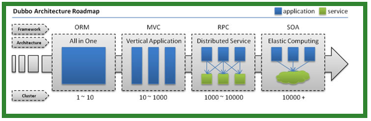
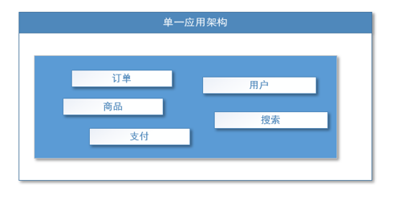
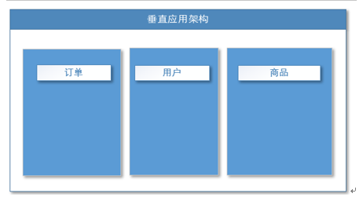
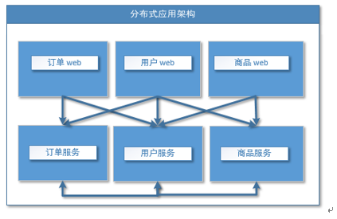
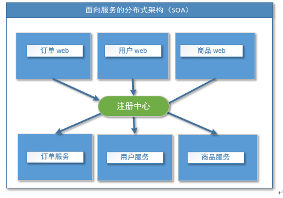
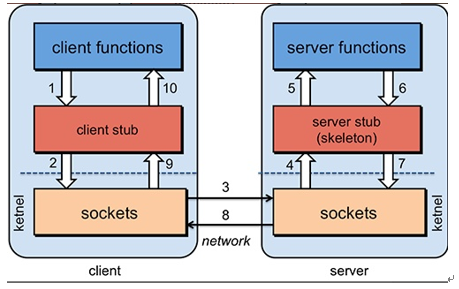
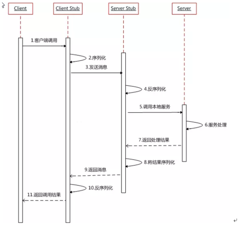
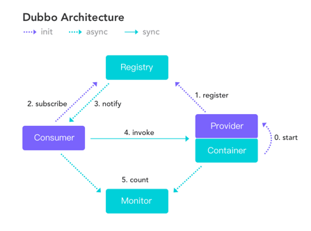
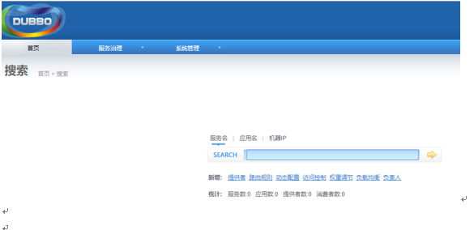

### 【分布式基础理论】

### 【一、基础理论】
### 【1、分布式基础理论】
### 【1.1 什么是分布式系统？】
>《分布式系统原理与范型》定义：
“分布式系统是若干独立计算机的集合，这些计算机对于用户来说就像单个相关系统”
分布式系统（distributed system）是建立在网络之上的软件系统。

随着互联网的发展，网站应用的规模不断扩大，常规的垂直应用架构已无法应对，分布式服务架构以及流动计算架构势在必行，亟需一个治理系统确保架构有条不紊的演进。

### 【1.2 发展演变】


- 单一应用架构      
当网站流量很小时，只需一个应用，将所有功能都部署在一起，以减少部署节点和成本。此时，用于简化增删改查工作量的数据访问框架(ORM)是关键。

适用于小型网站，小型管理系统，将所有功能都部署到一个功能里，简单易用。
缺点： 1、性能扩展比较难       
       2、协同开发问题     
       3、不利于升级维护

- 垂直应用架构
> 当访问量逐渐增大，单一应用增加机器带来的加速度越来越小，将应用拆成互不相干的几个应用，以提升效率。此时，用于加速前端页面开发的Web框架(MVC)是关键。


通过切分业务来实现各个模块独立部署，降低了维护和部署的难度，团队各司其职更易管理，性能扩展也更方便，更有针对性。

缺点： 公用模块无法重复利用，开发性的浪费

- 分布式服务架构
当垂直应用越来越多，应用之间交互不可避免，将核心业务抽取出来，作为独立的服务，逐渐形成稳定的服务中心，使前端应用能更快速的响应多变的市场需求。此时，用于提高业务复用及整合的分布式服务框架(RPC)是关键。


- 流动计算架构
当服务越来越多，容量的评估，小服务资源的浪费等问题逐渐显现，此时需增加一个调度中心基于访问压力实时管理集群容量，提高集群利用率。此时，用于提高机器利用率的资源调度和治理中心(SOA)[ Service Oriented Architecture]是关键。


### 【1.3 RPC】
#### 【1.3.1 什么是RPC】
RPC【Remote Procedure Call】是指远程过程调用，是一种进程间通信方式，他是一种技术的思想，而不是规范。它允许程序调用另一个地址空间（通常是共享网络的另一台机器上）的过程或函数，而不用程序员显式编码这个远程调用的细节。即程序员无论是调用本地的还是远程的函数，本质上编写的调用代码基本相同。

#### 【1.3.2 RPC基本原理】


RPC两个核心模块：通讯，序列化。


### 【2、dubbo核心概念】
#### 【2.1 简介】
Apache Dubbo (incubating) |ˈdʌbəʊ| 是一款高性能、轻量级的开源Java RPC框架，它提供了三大核心能力：面向接口的远程方法调用，智能容错和负载均衡，以及服务自动注册和发现。        
官网：
http://dubbo.apache.org/
#### 【2.1 基本概念】


> 服务提供者（Provider）：暴露服务的服务提供方，服务提供者在启动时，向注册中心注册自己提供的服务。

> 服务消费者（Consumer）: 调用远程服务的服务消费方，服务消费者在启动时，向注册中心订阅自己所需的服务，服务消费者，从提供者地址列表中，基于软负载均衡算法，选一台提供者进行调用，如果调用失败，再选另一台调用。   

> 注册中心（Registry）：注册中心返回服务提供者地址列表给消费者，如果有变更，注册中心将基于长连接推送变更数据给消费者     

>监控中心（Monitor）：服务消费者和提供者，在内存中累计调用次数和调用时间，定时每分钟发送一次统计数据到监控中心

----调用关系说明----
- 	服务容器负责启动，加载，运行服务提供者。
- 	服务提供者在启动时，向注册中心注册自己提供的服务。
- 	服务消费者在启动时，向注册中心订阅自己所需的服务。
- 	注册中心返回服务提供者地址列表给消费者，如果有变更，注册中心将基于长连接推送变更数据给消费者。
- 	服务消费者，从提供者地址列表中，基于软负载均衡算法，选一台提供者进行调用，如果调用失败，再选另一台调用。
- 	服务消费者和提供者，在内存中累计调用次数和调用时间，定时每分钟发送一次统计数据到监控中心。

### 【3、dubbo环境搭建】
#### 【3.1 windows-安装zookeeper】
```
1、下载zookeeper
网址 https://archive.apache.org/dist/zookeeper/zookeeper-3.4.13/ 

2、解压zookeeper
解压运行zkServer.cmd ，初次运行会报错，没有zoo.cfg配置文件

3、修改zoo.cfg配置文件
将conf下的zoo_sample.cfg复制一份改名为zoo.cfg即可。
注意几个重要位置：
dataDir=./   临时数据存储的目录（可写相对路径）
clientPort=2181   zookeeper的端口号
修改完成后再次启动zookeeper

4、使用zkCli.cmd测试
ls /：列出zookeeper根下保存的所有节点
create –e /gaozi 123：创建一个gaozi节点，值为123
get /gaozi：获取/gaozi节点的值
```
        

【windows】-安装dubbo-admin管理控制台    
dubbo本身并不是一个服务软件。它其实就是一个jar包能够帮你的java程序连接到zookeeper，并利用zookeeper消费、提供服务。所以你不用在Linux上启动什么dubbo服务。
但是为了让用户更好的管理监控众多的dubbo服务，官方提供了一个可视化的监控程序，不过这个监控即使不装也不影响使用。
```
1、下载dubbo-admin
https://github.com/apache/incubator-dubbo-ops 

2、进入目录，修改dubbo-admin配置
修改 src\main\resources\application.properties 指定zookeeper地址

3、打包dubbo-admin
mvn clean package -Dmaven.test.skip=true 

4、运行dubbo-admin
java -jar dubbo-admin-0.0.1-SNAPSHOT.jar

5、打开浏览器（默认使用root/root登录）
```


#### 【3.3 linux-安装zookeeper】
1、安装jdk
```
1、下载jdk
http://www.oracle.com/technetwork/java/javase/downloads/jdk8-downloads-2133151.html
 
不要使用wget命令获取jdk链接，这是默认不同意，导致下载来的jdk压缩内容错误

2、上传到服务器并解压
 
3、设置环境变量
/usr/local/java/jdk1.8.0_171
 
文件末尾加入下面配置
export JAVA_HOME=/usr/local/java/jdk1.8.0_171
export JRE_HOME=${JAVA_HOME}/jre
export CLASSPATH=.:${JAVA_HOME}/lib:${JRE_HOME}/lib
export PATH=${JAVA_HOME}/bin:$PATH
 
4、使环境变量生效&测试JDK
 

```
2、安装zookeeper
```
1、下载zookeeper
网址 https://archive.apache.org/dist/zookeeper/zookeeper-3.4.11/ 
wget https://archive.apache.org/dist/zookeeper/zookeeper-3.4.11/zookeeper-3.4.11.tar.gz  
2、解压
 
3、移动到指定位置并改名为zookeeper
 
```
 
3、开机启动zookeeper
```
1）-复制如下脚本
#!/bin/bash
#chkconfig:2345 20 90
#description:zookeeper
#processname:zookeeper
ZK_PATH=/usr/local/zookeeper
export JAVA_HOME=/usr/local/java/jdk1.8.0_171
case $1 in
         start) sh  $ZK_PATH/bin/zkServer.sh start;;
         stop)  sh  $ZK_PATH/bin/zkServer.sh stop;;
         status) sh  $ZK_PATH/bin/zkServer.sh status;;
         restart) sh $ZK_PATH/bin/zkServer.sh restart;;
         *)  echo "require start|stop|status|restart"  ;;
esac

2）-把脚本注册为Service
chkconfig --add zookeeper
chkconfig --list 

3）-增加权限
chmod +x /etc/init.d/zookeeper 
```

4、配置zookeeper
```
1、初始化zookeeper配置文件
拷贝/usr/local/zookeeper/conf/zoo_sample.cfg   
到同一个目录下改个名字叫zoo.cfg
 


2、启动zookeeper
service zookeeper start 

```
#### 【3.4 linux-安装dubbo-admin】
1、安装Tomcat8（旧版dubbo-admin是war，新版是jar不需要安装Tomcat）        
```
1、下载Tomcat8并解压
https://tomcat.apache.org/download-80.cgi
wget http://mirrors.shu.edu.cn/apache/tomcat/tomcat-8/v8.5.32/bin/apache-tomcat-8.5.32.tar.gz
2、解压移动到指定位置
 
3、开机启动tomcat8
 
复制如下脚本
#!/bin/bash
#chkconfig:2345 21 90
#description:apache-tomcat-8
#processname:apache-tomcat-8
CATALANA_HOME=/opt/apache-tomcat-8.5.32
export JAVA_HOME=/opt/java/jdk1.8.0_171
case $1 in
start)
    echo "Starting Tomcat..."  
    $CATALANA_HOME/bin/startup.sh
    ;;

stop)
    echo "Stopping Tomcat..."  
    $CATALANA_HOME/bin/shutdown.sh
    ;;

restart)
    echo "Stopping Tomcat..."  
    $CATALANA_HOME/bin/shutdown.sh
    sleep 2
    echo  
    echo "Starting Tomcat..."  
    $CATALANA_HOME/bin/startup.sh
    ;;
*)
    echo "Usage: tomcat {start|stop|restart}"  
    ;; esac

4、注册服务&添加权限
 
 
5、启动服务&访问tomcat测试
```

2、安装dubbo-admin
dubbo本身并不是一个服务软件。它其实就是一个jar包能够帮你的java程序连接到zookeeper，并利用zookeeper消费、提供服务。所以你不用在Linux上启动什么dubbo服务。
但是为了让用户更好的管理监控众多的dubbo服务，官方提供了一个可视化的监控程序，不过这个监控即使不装也不影响使用。
```
1、下载dubbo-admin
https://github.com/apache/incubator-dubbo-ops 
 

2、进入目录，修改dubbo-admin配置
修改 src\main\resources\application.properties 指定zookeeper地址
 
3、打包dubbo-admin
mvn clean package -Dmaven.test.skip=true 

4、运行dubbo-admin
java -jar dubbo-admin-0.0.1-SNAPSHOT.jar
默认使用root/root 登陆
 
```


### 【4、dubbo helloworld】
#### 【4.1 提出需求】