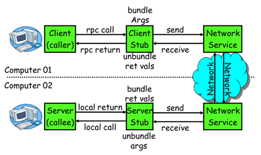
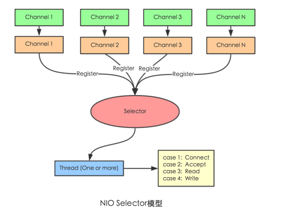

### 4 【dubbo原理】

1 【RPC原理】


 ```
一次完整的RPC调用流程（同步调用，异步另说）如下：
1）服务消费方（client）调用以本地调用方式调用服务；
2）client stub接收到调用后负责将方法、参数等组装成能够进行网络传输的消息体；
3）client stub找到服务地址，并将消息发送到服务端；
4）server stub收到消息后进行解码；
5）server stub根据解码结果调用本地的服务；
6）本地服务执行并将结果返回给server stub；
7）server stub将返回结果打包成消息并发送至消费方；
8）client stub接收到消息，并进行解码；
9）服务消费方得到最终结果。
RPC框架的目标就是要2~8这些步骤都封装起来，这些细节对用户来说是透明的，不可见的。(透明。。不可见？不矛盾吗？疑问(⊙o⊙)…)
```

2 【netty通信原理】   
>Netty是一个异步事件驱动的网络应用程序框架，用于快速开发可维护的高性能协议服务器和客户端。它极大地简化了TCP和UDP套接字服务器等网络编程。
  
BIO：(Blocking IO):      


NIO(Non-Blocking IO):       
       
>Selector 一般称为选择器，也可以翻译为多路复用器，       
Connect（连接就绪）、Accept（接受就绪）、Read（读就绪）、Write（写就绪）

Netty基本原理：      
 

3 【dubbo原理】        
3.1 【dubbo原理	-框架设计】            
             
- 	config 配置层：对外配置接口，以 ServiceConfig, ReferenceConfig 为中心，可以直接初始化配置类，也可以通过 spring 解析配置生成配置类

- 	proxy 服务代理层：服务接口透明代理，生成服务的客户端 Stub 和服务器端 Skeleton, 以 ServiceProxy 为中心，扩展接口为 ProxyFactory

- 	registry 注册中心层：封装服务地址的注册与发现，以服务 URL 为中心，扩展接口为 RegistryFactory, Registry, RegistryService

- 	cluster 路由层：封装多个提供者的路由及负载均衡，并桥接注册中心，以 Invoker 为中心，扩展接口为 Cluster, Directory, Router, LoadBalance

- 	monitor 监控层：RPC 调用次数和调用时间监控，以 Statistics 为中心，扩展接口为 MonitorFactory, Monitor, MonitorService

- 	protocol 远程调用层：封装 RPC 调用，以 Invocation, Result 为中心，扩展接口为 Protocol, Invoker, Exporter

- 	exchange 信息交换层：封装请求响应模式，同步转异步，以 Request, Response 为中心，扩展接口为 Exchanger, ExchangeChannel, ExchangeClient, ExchangeServer

- 	transport 网络传输层：抽象 mina 和 netty 为统一接口，以 Message 为中心，扩展接口为 Channel, Transporter, Client, Server, Codec

- 	serialize 数据序列化层：可复用的一些工具，扩展接口为 Serialization, ObjectInput, ObjectOutput, ThreadPool


3.2 【dubbo原理	-启动解析、加载配置信息】       
 

3.3 【dubbo原理	-服务暴露】      
 

3.4 【dubbo原理	-服务引用】      
 

3.5 【dubbo原理	-服务调用】      
 


