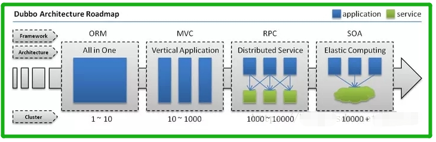
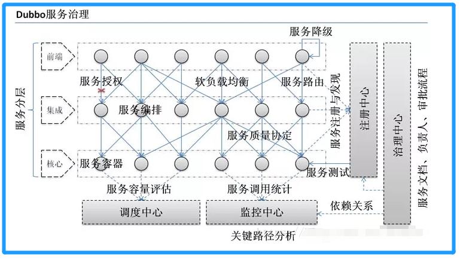
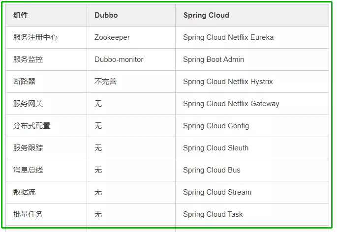
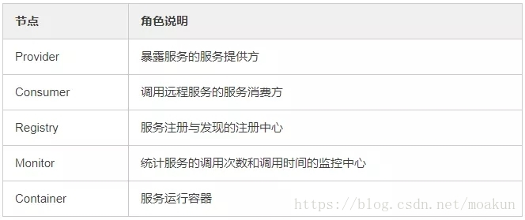
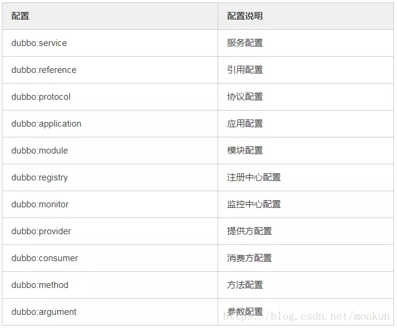
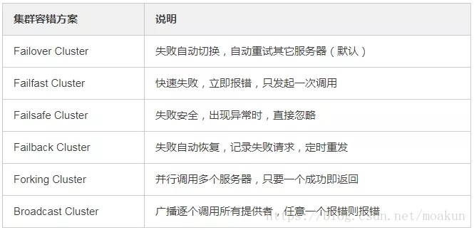
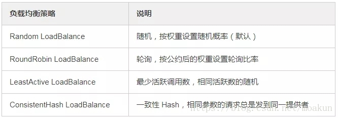
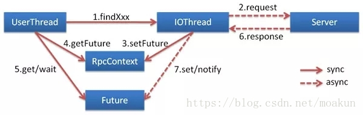

1、dubbo是什么        

Dubbo是阿里巴巴开源的基于 Java 的高性能 RPC 分布式服务框架，提供服务自动注册、自动发现等高效服务治理方案， 可以和 Spring 框架无缝集成，现已成为 Apache 基金会孵化项目。        
说白了其实dubbo就是一个远程调用的分布式框架。
 
2、为什么要用Dubbo
因为是阿里开源项目，国内很多互联网公司都在用，已经经过很多线上考验。内部使用了 Netty、Zookeeper，保证了高性能高可用性。

使用 Dubbo 可以将核心业务抽取出来，作为独立的服务，逐渐形成稳定的服务中心，可用于提高业务复用灵活扩展，使前端应用能更快速的响应多变的市场需求。

下面这张图可以很清楚的诠释，最重要的一点是，分布式架构可以承受更大规模的并发流量。       

下面是 Dubbo 的服务治理图。       

3、Dubbo 和 Spring Cloud 有什么区别？       
两个没关联，如果硬要说区别，有以下几点。        
1）通信方式不同

Dubbo 使用的是 RPC 通信，而 Spring Cloud 使用的是 HTTP RESTFul 方式。

2）组成部分不同        

4、dubbo都支持什么协议，推荐用哪种？       
dubbo://（推荐）        
rmi://      
hessian://      
http://     
webservice://       
thrift://       
memcached://        
redis://        
rest://     

5、dubbo需要web容器吗，Dubbo内置了哪几种服务容器？        

Spring Container        
Jetty Container
Log4j Container

不需要，Dubbo 的服务容器只是一个简单的 Main 方法，并加载一个简单的 Spring 容器，用于暴露服务。

6、Dubbo里面有哪几种节点角色？      
     

7、画一画服务注册与发现的流程图        

8、Dubbo默认使用什么注册中心，还有别的选择吗？      
推荐使用 Zookeeper 作为注册中心，还有 Redis、Multicast、Simple 注册中心，但不推荐。

9、Dubbo有哪几种配置方式？       
1）Spring 配置方式       
2）Java API 配置方式
 
10、Dubbo 核心的配置有哪些？

我曾经面试就遇到过面试官让你写这些配置，我也是蒙逼。。 

11、在 Provider 上可以配置的 Consumer 端的属性有哪些？

1）timeout：方法调用超时
2）retries：失败重试次数，默认重试 2 次
3）loadbalance：负载均衡算法，默认随机
4）actives 消费者端，最大并发调用限制

12、Dubbo启动时如果依赖的服务不可用会怎样？

Dubbo 缺省会在启动时检查依赖的服务是否可用，不可用时会抛出异常，阻止 Spring 初始化完成，默认 check="true"，可以通过 check="false" 关闭检查。

13、Dubbo推荐使用什么序列化框架，你知道的还有哪些？

推荐使用Hessian序列化，还有Duddo、FastJson、Java自带序列化。

14、Dubbo默认使用的是什么通信框架，还有别的选择吗？

Dubbo 默认使用 Netty 框架，也是推荐的选择，另外内容还集成有Mina、Grizzly。

15、Dubbo有哪几种集群容错方案，默认是哪种？       

16、Dubbo有哪几种负载均衡策略，默认是哪种？       

17、注册了多个同一样的服务，如果测试指定的某一个服务呢？

可以配置环境点对点直连，绕过注册中心，将以服务接口为单位，忽略注册中心的提供者列表。

18、Dubbo支持服务多协议吗？

Dubbo 允许配置多协议，在不同服务上支持不同协议或者同一服务上同时支持多种协议。

19、当一个服务接口有多种实现时怎么做？

当一个接口有多种实现时，可以用 group 属性来分组，服务提供方和消费方都指定同一个 group 即可。

20、服务上线怎么兼容旧版本？

可以用版本号（version）过渡，多个不同版本的服务注册到注册中心，版本号不同的服务相互间不引用。这个和服务分组的概念有一点类似。

21、Dubbo可以对结果进行缓存吗？

可以，Dubbo 提供了声明式缓存，用于加速热门数据的访问速度，以减少用户加缓存的工作量。

22、Dubbo服务之间的调用是阻塞的吗？

默认是同步等待结果阻塞的，支持异步调用。

Dubbo 是基于 NIO 的非阻塞实现并行调用，客户端不需要启动多线程即可完成并行调用多个远程服务，相对多线程开销较小，异步调用会返回一个 Future 对象。

异步调用流程图如下。

23、Dubbo支持分布式事务吗？       
目前暂时不支持，可与通过 tcc-transaction框架实现

介绍：tcc-transaction是开源的TCC补偿性分布式事务框架

Git地址：https://github.com/changmingxie/tcc-transaction

24、Dubbo如何优雅停机？

Dubbo 是通过 JDK 的 ShutdownHook 来完成优雅停机的，所以如果使用 kill -9 PID 等强制关闭指令，是不会执行优雅停机的，只有通过 kill PID 时，才会执行。

25、服务提供者能实现失效踢出是什么原理？

服务失效踢出基于 Zookeeper 的临时节点原理。     
>在分布式系统中,我们常常需要知道某个机器是否可用,传统的开发中,可以通过Ping某个主机来实现,Ping得通说明对方是可用的,相反是不可用的,ZK 中我们让所有的机器都注册一个临时节点,我们判断一个机器是否可用,我们只需要判断这个节点在ZK中是否存在就可以了,不需要直接去连接需要检查的机器,降低系统的复杂度。

26、服务读写推荐的容错策略是怎样的？

读操作建议使用 Failover 失败自动切换，默认重试两次其他服务器。

写操作建议使用 Failfast 快速失败，发一次调用失败就立即报错。

27、Dubbo必须依赖的包有哪些？

Dubbo 必须依赖 JDK，其他为可选。

28、Dubbo的管理控制台能做什么？

管理控制台主要包含：路由规则，动态配置，服务降级，访问控制，权重调整，负载均衡，等管理功能。

29、说说 Dubbo 服务暴露的过程。

Dubbo 会在 Spring 实例化完 bean 之后，在刷新容器最后一步发布 ContextRefreshEvent 事件的时候，通知实现了 ApplicationListener 的 ServiceBean 类进行回调 onApplicationEvent 事件方法，Dubbo 会在这个方法中调用 ServiceBean 父类 ServiceConfig 的 export 方法，而该方法真正实现了服务的（异步或者非异步）发布。

30、Dubbo 停止维护了吗？

2014 年开始停止维护过几年，17 年开始重新维护，并进入了 Apache 项目。

31、Dubbo 和 Dubbox 有什么区别？

Dubbox 是继 Dubbo 停止维护后，当当网基于 Dubbo 做的一个扩展项目，如加了服务可 Restful 调用，更新了开源组件等。

32、你还了解别的分布式框架吗？

别的还有 Spring cloud、Facebook 的 Thrift、Twitter 的 Finagle 等。

33、Dubbo 能集成 Spring Boot 吗？

可以的，项目地址如下。

https://github.com/apache/incubator-dubbo-spring-boot-project

34、在使用过程中都遇到了些什么问题？

Dubbo 的设计目的是为了满足高并发小数据量的 rpc 调用，在大数据量下的性能表现并不好，建议使用 rmi 或 http 协议。

35、你读过 Dubbo 的源码吗？

要了解 Dubbo 就必须看其源码，了解其原理，花点时间看下吧，网上也有很多教程，后续有时间我也会在公众号上分享 Dubbo 的源码。

36、你觉得用 Dubbo 好还是 Spring Cloud 好？

扩展性的问题，没有好坏，只有适合不适合，不过我好像更倾向于使用 Dubbo, Spring Cloud 版本升级太快，组件更新替换太频繁，配置太繁琐，还有很多我觉得是没有 Dubbo 顺手的地方……

SPI
37、你是否了解SPI，讲一讲什么是SPI，为什么要使用SPI?
SPI具体约定：当服务的提供者，提供了服务接口的一种实现之后，在jar包的META-INF/services/目录里同时创建一个以服务接口命名的文件。该文件里就是实现该服务接口的具体实现类。而当外部程序装配这个模块的时候，就能通过该jar包META-INF/services/里的配置文件找到具体的实现类名，并装载实例化，完成模块的注入（从使用层面来说，就是运行时，动态给接口添加实现类）。 基于这样一个约定就能很好的找到服务接口的实现类，而不需要再代码里制定（不需要在代码里写死）。
这样做的好处：java设计出SPI目的是为了实现在模块装配的时候能不在程序里动态指明，这就需要一种服务发现机制。这样程序运行的时候，该机制就会为某个接口寻找服务的实现，有点类似IOC的思想，就是将装配的控制权移到程序之外，在模块化设计中这个机制尤其重要。例如，JDBC驱动，可以加载MySQL、Oracle、或者SQL Server等，目前有不少框架用它来做服务的扩张发现。回答这个问题可以延伸一下和API的对比，API是将方法封装起来给调用者使用的，SPI是给扩展者使用的。

38、对类加载机制了解吗,说一下什么是双亲委托模式,他有什么弊端,这个弊端有没有什么我们熟悉的案例,解决这个弊端的原理又是怎么样的?
扩展延生的一道题。

39、Dubbo的SPI和JDK的SPI有区别吗？有的话，究竟有什么区别？
Dubbo 的扩展点加载是基于JDK 标准的 SPI 扩展点发现机制增强而来的，Dubbo 改进了 JDK 标准的 SPI 的以下问题：

JDK 标准的 SPI 会一次性实例化扩展点所有实现，如果有扩展实现初始化很耗时，但如果没用上也加载，会很浪费资源。
增加了对扩展点 IoC 和 AOP 的支持，一个扩展点可以直接 setter 注入其它扩展点。

上文已提供。另外在博客中也单独对此写了一篇《Dubbo内核之SPI机制》、《跟我学Dubbo系列之Java SPI机制简介》

40、Dubbo中SPI也增加了IoC，先讲讲Spring的IoC，然后再讲讲Dubbo里面又是怎么做的

41、Dubbo中SPI也增加了AOP，那你讲讲这用到了什么设计模式，Dubbo又是如何做的.

42、有没有考虑过自己实现一个类似dubbo的RPC框架,如果有,请问你会如果着手实现?(面试高频题,区分度高)
可从两个方面去入手，考虑接口扩展性，改造JDK的SPI机制来实现自己的扩展SPI机制。另外就是从动态代理入手，从网络通信、编码解码这些步骤以动态代理的方式植入远程调用方法中，实现透明化的调用。

43、服务发布过程中做了哪些事？
暴露本地服务、暴露远程服务、启动netty、连接zookeeper、到zookeeper注册、监听zookeeper

44、dubbo都有哪些协议,他们之间有什么特点,缺省值是什么？
dubbo支持多种协议，默认使用的是dubbo协议，具体介绍官方文档写得很清楚，传送地址:相关协议介绍，重点是掌握好推荐dubbo协议。Dubbo 缺省协议采用单一长连接和 NIO 异步通讯，适合于小数据量大并发的服务调用，以及服务消费者机器数远大于服务提供者机器数的情况。

45、什么是本地暴露和远程暴露,他们的区别？
在dubbo中我们一个服务可能既是Provider,又是Consumer,因此就存在他自己调用自己服务的情况,如果再通过网络去访问,那自然是舍近求远,因此他是有本地暴露服务的这个设计.从这里我们就知道这个两者的区别

本地暴露是暴露在JVM中,不需要网络通信.
远程暴露是将ip,端口等信息暴露给远程客户端,调用时需要网络通信.

【参考】        
[https://blog.csdn.net/moakun/article/details/82919804](参考1)        

[https://www.jianshu.com/p/292fcdcfe41e?utm_campaign=maleskine&utm_content=note&utm_medium=seo_notes&utm_source=recommendation](参考2)

