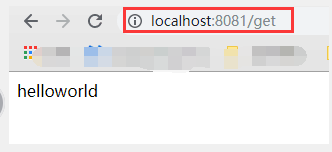

### 1、spring-world工程     
1>WorldController
```java
/**
 * <p>WorldController
 * </p>
 *
 * @author gaoqiangwei
 * @date 2019/7/11 11:18
 **/
@Slf4j
@RestController
public class WorldController {

    @RequestMapping("/get")
    public String getWorld(){
        log.info("---get world---");
        return "world";
    }
}
```
2、application.properties        
```
server.port=8080
```
3、Dockerfile
```
FROM frolvlad/alpine-oraclejdk8:slim
VOLUME /tmp
ADD ./target/spring-world.jar app.jar
ENTRYPOINT ["java","-jar","/app.jar"]
```
注意：jar包的名称和Dockerfile的相对路径

### 2、spring-hello工程        
1>helloController
```
/*
 * Copyright (C) 2019 VIPKID, Inc. All Rights Reserved.
 */
package com.gaoqiangwei.springhello.controller;

import org.springframework.beans.factory.annotation.Autowired;
import org.springframework.http.ResponseEntity;
import org.springframework.web.bind.annotation.RequestMapping;
import org.springframework.web.bind.annotation.RestController;
import org.springframework.web.client.RestTemplate;

import lombok.extern.slf4j.Slf4j;

/**
 * <p>HelloController
 * </p>
 *
 * @author gaoqiangwei
 * @date 2019/7/11 17:11
 **/
@RestController
@Slf4j
public class HelloController {

    @Autowired
    RestTemplate restTemplate;

    public static final String HELLO_STR = "hello";

    public static final String HTTP_WORLD_URL = "http://spring-world:8080";

    @RequestMapping("/get")
    public String getHello(){
        log.info("---请求进入---");
        //【请求】
        ResponseEntity<String> result = restTemplate.getForEntity(HTTP_WORLD_URL + "/get",String.class);
        //【拼接】
        String resultStr = HELLO_STR + result.getBody();
        //【响应】
        log.info("----请求详情--body:{}--result:{}", result.getBody(), resultStr);
        return resultStr;
    }
}
```
2、application.properties        
```
server.port=8080
```

3、Dockerfile
```
FROM frolvlad/alpine-oraclejdk8:slim
VOLUME /tmp
ADD ./target/spring-hello.jar app.jar
ENTRYPOINT ["java", "-Dspring-world=spring-world","-jar","/app.jar"]
```
注意：jar包的名称和Dockerfile的相对路径

4、docker-compose.yml
```
version: '3'
services:
  spring-hello:
    image: spring-hello
    ports:
    - '8081:8080'
    container_name: spring-hello
    restart: always
  spring-world:
    image: spring-world
    ports:
    - '8080:8080'
    container_name: spring-world
    restart: always
```

-------------启动顺序----------     
1、先打spring-world的镜像     
```
docker build -t spring-world .
```
2、再打spring-hello的镜像    
```
docker build . -t spring-hello
```
3、启动spring-hello        
```
docker-compose up
```
4、访问spring-hello的接口，展示成果~~~     
