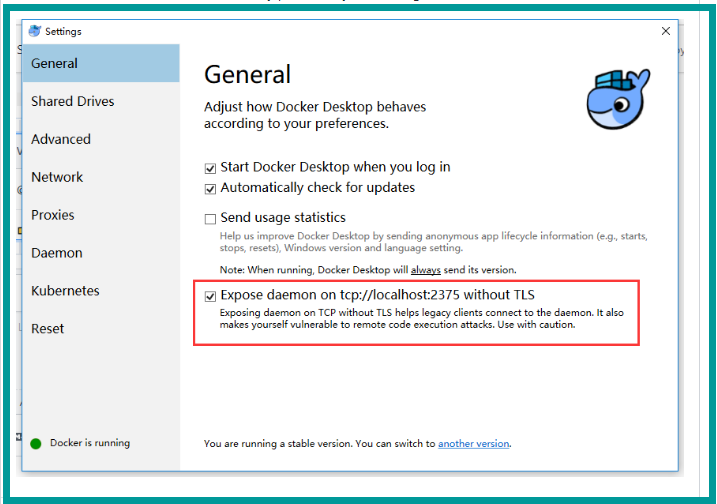

### 1、【安装windos-docker】

### 2、【配置阿里云镜像加速】
```
https://idh6r1kx.mirror.aliyuncs.com
```

### 3、【快速创建springboot项目】
```
https://start.spring.io/
```

### 4、【pom.xml添加docker插件】
````
<properties>
         
        <docker.image.prefix>gaozi</docker.image.prefix> <!-- 在docker运行时要用的，只是一个前缀而已，就像包名一样,可自己任意定义此名称 -->
         
    </properties>
---------------------
<!-- docker 插件 begin -->
            <plugin>
                <groupId>com.spotify</groupId>
                <artifactId>docker-maven-plugin</artifactId>
                <version>1.0.0</version>
                <configuration>
                    <imageName>${docker.image.prefix}/${project.artifactId}</imageName>
                    <dockerDirectory>src/main/docker</dockerDirectory>
                    <resources>
                        <resource>
                            <targetPath>/</targetPath>
                            <directory>${project.build.directory}</directory>
                            <include>${project.build.finalName}.jar</include>
                        </resource>
                    </resources>
                </configuration>
            </plugin>
            <!-- docker 插件 end -->
---------------------

````

### 5、【在src/main/目录下建立docker文件夹，并添加Dockerfile.txt文件】
```
FROM frolvlad/alpine-oraclejdk8:slim
VOLUME /tmp
ADD spring-world.jar app.jar
ENTRYPOINT ["java","-jar","/app.jar"]
```


### 6、【打包和构建docker镜像】
```
mvn clean package docker:build
```

### 7、【查看docker images并运行容器】
```
docker images
docker run -p 8080:8080 -t gaozi/spring-world
docker run -p 8080:8080 -t gaozi/spring-hello
```


-----高仔踩坑记------
1、如果遇到如下报错
```
[ERROR] Failed to execute goal com.spotify:dockerfile-maven-plugin:1.4.7:build (default-cli) on project gs-spring-boot-docker: Could not build ima
ge: java.util.concurrent.ExecutionException: com.spotify.docker.client.shaded.javax.ws.rs.ProcessingException: com.spotify.docker.client.shaded.or
g.apache.http.conn.HttpHostConnectException: Connect to localhost:2375 [localhost/127.0.0.1, localhost/0:0:0:0:0:0:0:1] failed: Connection refused
: connect -> [Help 1]
```
解决办法：



2、如果遇到如下报错  
```
ADD failed: stat /var/lib/docker/tmp/docker-builderXXXXXX: no such file or directory
```
解决办法：       
修改Dockerfile.txt文件里的jar的名字，这个名字一定要和maven打包后target目录下的名字一致，否则docker找不到这个jar


-----参考资料------
1、https://github.com/spotify/dockerfile-maven/issues/266

2、https://blog.csdn.net/weixin_34186931/article/details/92103383

3、https://blog.csdn.net/puhaiyang/article/details/77530417