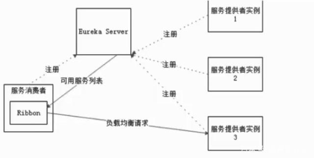

### 0-【背景】
首先，有两个问题        
第一个问题就是当有多个用户服务节点的时候，我们如何让该服务调用其它服务实现负载均衡。

第二个问题就是我们如何让该服务调用其它服务的时候去使用Eureka Server里面的信息，现在还是通过硬编码去调用的。

首先我们去解决第一个问题，大家应该都知道的一种实现负载均衡的方式，就是在用户服务前面去添加一个nginx，这是一种服务器端负载均衡的方式。
      

既然现在有服务器负载均衡，那就有另外一种实现方式就是客户端负载均衡,这里我就要引出Ribbon这个组件。        

Ribbon是什么？      
Ribbon是Netflix发布的开源项目，主要功能是提供客户端的软件负载均衡算法，将Netflix的中间层服务连接在一起。Ribbon客户端组件提供一系列完善的配置项如连接超时，重试等。简单的说，就是在配置文件中列出Load Balancer（简称LB）后面所有的机器，Ribbon会自动的帮助你基于某种规则（如简单轮询，随即连接等）去连接这些机器。我们也很容易使用Ribbon实现自定义的负载均衡算法。     
       

### 1-【简介】
Ribbon是Netflix发布的开源项目，主要功能是提供客户端的软件负载均衡算法，将Netflix的中间层服务连接在一起。Ribbon客户端组件提供一系列完善的配置项如连接超时，重试等。简单的说，就是在配置文件中列出Load Balancer（简称LB）后面所有的机器，Ribbon会自动的帮助你基于某种规则（如简单轮询，随即连接等）去连接这些机器。我们也很容易使用Ribbon实现自定义的负载均衡算法。 

### 2-【LB方案分类】
目前主流的LB方案可分成两类：一种是集中式LB, 即在服务的消费方和提供方之间使用独立的LB设施(可以是硬件，如F5, 也可以是软件，如nginx), 由该设施负责把访问请求通过某种策略转发至服务的提供方；另一种是进程内LB，将LB逻辑集成到消费方，消费方从服务注册中心获知有哪些地址可用，然后自己再从这些地址中选择出一个合适的服务器。Ribbon就属于后者，它只是一个类库，集成于消费方进程，消费方通过它来获取到服务提供方的地址。        

### 3-【Ribbon的主要组件与工作流程】
Ribbon的核心组件(均为接口类型)有以下几个：
- ServerList:用于获取地址列表。它既可以是静态的(提供一组固定的地址)，也可以是动态的(从注册中心中定期查询地址列表)。        
- ServerListFilter:仅当使用动态ServerList时使用，用于在原始的服务列表中使用一定策略过虑掉一部分地址。     
- IRule:选择一个最终的服务地址作为LB结果。选择策略有轮询、根据响应时间加权、断路器(当Hystrix可用时)等。    
   
Ribbon在工作时首选会通过ServerList来获取所有可用的服务列表，然后通过ServerListFilter过虑掉一部分地址，最后在剩下的地址中通过IRule选择出一台服务器作为最终结果。

### 4-【Ribbon提供的主要负载均衡策略介绍】
1:简单轮询负载均衡（RoundRobin):以轮询的方式依次将请求调度不同的服务器，即每次调度执行i = (i + 1) mod n，并选出第i台服务器。      
2:随机负载均衡 （Random): 随机选择状态为UP的Server     
3:加权响应时间负载均衡 （WeightedResponseTime):根据相应时间分配一个weight，相应时间越长，weight越小，被选中的可能性越低。     
4:区域感知轮询负载均衡（ZoneAvoidanceRule):复合判断server所在区域的性能和server的可用性选择server
Ribbon自带负载均衡策略比较

### 5-【Ribbon结合eureka使用】
1、创建maven工程 eureka_ribbon_client 该工程启动和相关配置依赖：
```
<parent>
    <groupId>org.springframework.boot</groupId>
    <artifactId>spring-boot-starter-parent</artifactId>
    <version>1.4.3.RELEASE</version>
    <relativePath/> <!-- lookup parent from repository -->
</parent>
<dependencies>
    <dependency>
        <groupId>org.springframework.cloud</groupId>
        <artifactId>spring-cloud-starter-ribbon</artifactId>
    </dependency>
    <dependency>
        <groupId>org.springframework.cloud</groupId>
        <artifactId>spring-cloud-starter-eureka</artifactId>
    </dependency>
    <dependency>
        <groupId>org.springframework.boot</groupId>
        <artifactId>spring-boot-starter-web</artifactId>
    </dependency>
    <dependency>
        <groupId>org.springframework.boot</groupId>
        <artifactId>spring-boot-starter-test</artifactId>
        <scope>test</scope>
    </dependency>
</dependencies>
<dependencyManagement>
    <dependencies>
        <dependency>
        <groupId>org.springframework.cloud</groupId>
        <artifactId>spring-cloud-dependencies</artifactId>
        <version>Brixton.RELEASE</version>
        <type>pom</type>
        <scope>import</scope>
    </dependency>
    </dependencies>
</dependencyManagement>
```

2、在应用主类中，通过@EnableDiscoveryClient注解来添加发现服务能力。创建RestTemplate实例，并通过@LoadBalanced注解开启均衡负载能力。       
```
@SpringBootApplication
@EnableDiscoveryClient
public class RibbonApplication {
    @Bean
    @LoadBalanced
    RestTemplate restTemplate() {
        return new RestTemplate();
    }
    public static void main(String[] args) {
        SpringApplication.run(RibbonApplication.class, args);
    }
}

```
        
        
3、创建ConsumerController来消费service01的getuser服务。通过直接RestTemplate来调用服务
```java
@RestController
public class ConsumerController {
 
    @Autowired
    RestTemplate restTemplate;
 
    @RequestMapping(value = "/getuserinfo", method = RequestMethod.GET)
    public String add() {
        return restTemplate.getForEntity("http://biz-service-0/getuser", String.class).getBody();
    }
}
``` 
Ribbon其实就是一个软负载均衡的客户端组件，他可以和其他所需请求的客户端结合使用，和eureka结合只是其中的一个实例。


