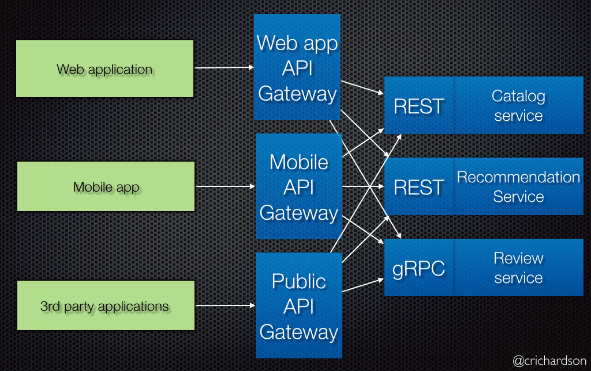

### 一、什么是API网关      
在微服务架构中，通常会有多个服务提供者。设想一个电商系统，可能会有商品、订单、支付、用户等多个类型的服务，而每个类型的服务数量也会随着整个系统体量的增大也会随之增长和变更。作为UI端，在展示页面时可能需要从多个微服务中聚合数据，而且服务的划分位置结构可能会有所改变。网关就可以对外暴露聚合API，屏蔽内部微服务的微小变动，保持整个系统的稳定性。

当然这只是网关众多功能中的一部分，它还可以做负载均衡，统一鉴权，协议转换，监控监测等一系列功能。        

下图是一张典型的Backend for Front-End网关：        
     


### 二、什么是Zuul   
Zuul是Spring Cloud全家桶中的微服务API网关。     

所有从设备或网站来的请求都会经过Zuul到达后端的Netflix应用程序。作为一个边界性质的应用程序，Zuul提供了动态路由、监控、弹性负载和安全功能。Zuul底层利用各种filter实现如下功能：     

- 认证和安全 识别每个需要认证的资源，拒绝不符合要求的请求。
- 性能监测 在服务边界追踪并统计数据，提供精确的生产视图。
- 动态路由 根据需要将请求动态路由到后端集群。
- 压力测试 逐渐增加对集群的流量以了解其性能。
- 负载卸载 预先为每种类型的请求分配容量，当请求超过容量时自动丢弃。
- 静态资源处理 直接在边界返回某些响应。       

### 三、编写一个Zuul网关
1、新建一个gateway-zuul-demo模块，在依赖项处添加【Cloud Discovery->Eureka Discovery和Cloud Rouing->Zuul】。      

2、修改入口类，增加EnableZuulProxy注解     
```
@SpringBootApplication
@EnableZuulProxy
public class GatewayZuulDemoApplication {
 
    public static void main(String[] args) {
        SpringApplication.run(GatewayZuulDemoApplication.class, args);
    }
}
```

3、修改appliation.yml      
```
server:
  port: 9006
spring:
  application:
    name: gateway-zuul-demo
eureka:
  client:
    service-url:
      defaultZone: http://localhost:8761/eureka/,http://localhost:8762/eureka/
  instance:
    prefer-ip-address: true
```

4、启动Eureka Server、Rest-Demo和Gateway-Zuul-Demo，在浏览器中输入http://localhost:9006/rest-demo/user/xdlysk获取返回结果。     

从上面的例子中的地址可以看出来默认Zuul的路由方式是：http://ZUULHOST:ZUULPORT/serviceId/**。

如果启动多个Rest-Demo可以发现Zuul里面还内置了Ribbon的负载均衡功能。


### 四、路由配置
Zuul提供了一套简单且强大路由配置策略，利用路由配置我们可以完成对微服务和URL更精确的控制。        
1、重写指定微服务的访问路径：     
```
zuul:
  routes:
    rest-demo: /rest/**
```
这表示将rest-demo微服务的地址映射到/rest/**路径。       


2、忽略指定微服务：      
```
zuul:
  ignored-services: rest-demo,xxx-service
```
使用“*”可忽略所有微服务，多个指定微服务以半角逗号分隔。       


3、忽略所有微服务，只路由指定微服务：     
```
zuul:
  ignored-services: *
  routes:
    rest-demo: /rest/**
```

4、路由别名：     
```
zuul:
  routes:
    route-name: #路由别名，无其他意义，与例1效果一致
      service-id: rest-demo
      path: /rest/**
```

5、指定path和URL        
```
zuul:
  routes:
    route-name:
      url: http://localhost:8000/
      path: /rest/**
```

此例将http://ZUULHOST:ZUULPORT/rest/映射到http://localhost:8000/。同时由于并非用service-id定位服务，所以也无法使用负载均衡功能。     

6、既指定path和URL，又保留Zuul的Hystrix、Ribbon特性      
```
zuul:
  routes:
    route-name: #路由别名，无其他意义，与例1效果一致
      service-id: rest-demo
      path: /rest/**
ribbon:
  eureka:
    enable: false #为Ribbon禁用Eureka
rest-demo:
  ribbon:
    listOfServers: localhost:9000,localhost:9001
```

7、借助PatternServiceRouteMapper实现路由的正则匹配      
```

@Bean
public PatternServiceRouteMapper serviceRouteMapper(){
    /**
     * A RegExp Pattern that extract needed information from a service ID. Ex :
     * "(?<name>.*)-(?<version>v.*$)"
     */
    //private Pattern servicePattern;
    /**
     * A RegExp that refer to named groups define in servicePattern. Ex :
     * "${version}/${name}"
     */
    //private String routePattern;
    return new PatternServiceRouteMapper("(?<name>^.+)-(?<version>v.+$)", "${version}/${name}");
}
```
此例可以将rest-demo-v1映射为/v1/rest-demo/**。

8、路由前缀
```
zuul:
  prefix: /api
  strip-prefix: true
  routes:
    rest-demo: /rest/**
```
此时访问Zuul的/api/rest/user/xdlysk会被转发到/rest-demo/user/xdlysk。

9、忽略某些微服务中的某些路径     
```
zuul:
  ignoredPatterns: /**/user/* #忽略所有包含/user/的地址请求
  routes:
    route-demo:
      service-Id: rest-demo
      path: /rest/**
```

更多的配置项和配置方法可以参考     
spring-cloud-netflix-zuul/src/main/java/org/springframework/cloud/netflix/zuul/filters/ZuulProperties.java并结合上述例子扩展。在ZuulProperties.java中每个字段都会有注释解释其作用。        

### 五、Filter工作原理
5.1 Zuul中的Filter        
Zuul是围绕一系列Filter展开的，这些Filter在整个HTTP请求过程中执行一连串的操作。       
Zuul Filter有以下几个特征：     
- Type：用以表示路由过程中的阶段（内置包含PRE、ROUTING、POST和ERROR）     
- Execution Order：表示相同Type的Filter的执行顺序
- Criteria：执行条件
- Action：执行体    
Zuul提供了动态读取、编译和执行Filter的框架。各个Filter间没有直接联系，但是都通过RequestContext共享一些状态数据。     
尽管Zuul支持任何基于JVM的语言，但是过滤器目前是用Groovy编写的。 每个过滤器的源代码被写入到Zuul服务器上的一组指定的目录中，这些目录将被定期轮询检查是否更新。Zuul会读取已更新的过滤器，动态编译到正在运行的服务器中，并后续请求中调用。      

5.2 Filter Types
以下提供四种标准的Filter类型及其在请求生命周期中所处的位置：       
- PRE Filter：在请求路由到目标之前执行。一般用于请求认证、负载均衡和日志记录。
- ROUTING Filter：处理目标请求。这里使用Apache HttpClient或Netflix Ribbon构造对目标的HTTP请求。
- POST Filter：在目标请求返回后执行。一般会在此步骤添加响应头、收集统计和性能数据等。
- ERROR Filter：整个流程某块出错时执行。

除了上述默认的四种Filter类型外，Zuul还允许自定义Filter类型并显示执行。例如，我们定义一个STATIC类型的Filter，它直接在Zuul中生成一个响应，而非将请求在转发到目标。            

5.3 Zuul请求生命周期
一图胜千言，下面通过官方的一张图来了解Zuul请求的生命周期。     
     

5.4 自定义一个Filter     
1、添加一个PreRequestLogFilter:
```
public class PreRequestLogFilter extends ZuulFilter{
 
    @Override
    public String filterType() {
        return PRE_TYPE;
    }
 
    @Override
    public int filterOrder() {
        return 0;
    }
 
    @Override
    public boolean shouldFilter() {
        return true;
    }
 
    @Override
    public Object run() {
        RequestContext currentContext = RequestContext.getCurrentContext();
        HttpServletRequest request = currentContext.getRequest();
        System.out.print(String.format("send %s request to %s",request.getMethod(),request.getRequestURL()));
        return null;
    }
}
```
2、修改启动类GatewayZuulDemoApplication，添加Filter注入：       
```
@Bean
public PreRequestLogFilter preRequestLogFilter(){
    return new PreRequestLogFilter();
}
```
3、启动服务并请求服务，观察控制台输出日志信息。        

5.4 Filter的启用与禁用
我们自己写的Filter可以通过修改shouldFilter()启用或禁用。如果第三方的Filter怎样控制其启用及禁用呢？

很简单，通过配置文件就可以做到：
```
zuul:
  PreRequestLogFilter: #自定义Filter类名
    pre: #Type
      disable: true
```


