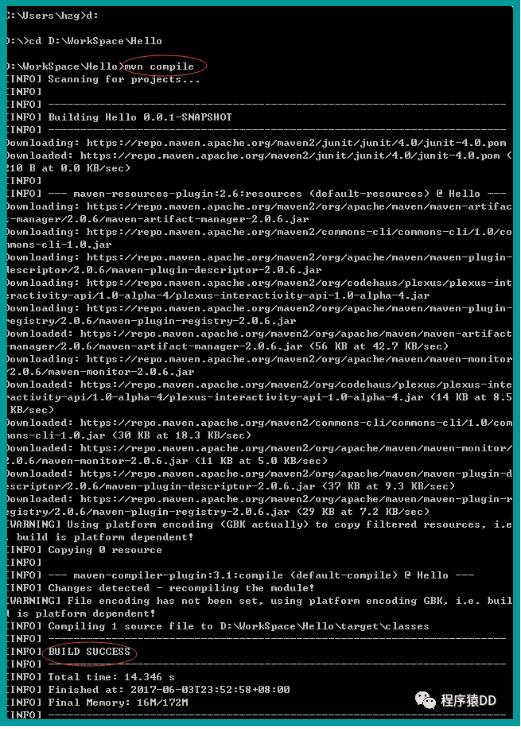

### 【总结】
###一、为什么使用Maven这样的构建工具【why】        
① 一个项目就是一个工程

如果项目非常庞大，就不适合使用package来划分模块，最好是每一个模块对应一个工程，利于分工协作。

借助于maven就可以将一个项目拆分成多个工程

② 项目中使用jar包，需要“复制”、“粘贴”项目的lib中

同样的jar包重复的出现在不同的项目工程中，你需要做不停的复制粘贴的重复工作。

借助于maven，可以将jar包保存在“仓库”中，不管在哪个项目只要使用引用即可就行。

③ jar包需要的时候每次都要自己准备好或到官网下载

借助于maven我们可以使用统一的规范方式下载jar包，规范

④ jar包版本不一致的风险

不同的项目在使用jar包的时候，有可能会导致各个项目的jar包版本不一致，导致未执行错误。

借助于maven，所有的jar包都放在“仓库”中，所有的项目都使用仓库的一份jar包。

⑤ 一个jar包依赖其他的jar包需要自己手动的加入到项目中

FileUpload组件->IO组件，commons-fileupload-1.3.jar依赖于commons-io-2.0.1.jar

极大的浪费了我们导入包的时间成本，也极大的增加了学习成本。

借助于maven，它会自动的将依赖的jar包导入进来。
        
### 二、maven是什么【what】        
① maven是一款服务于java平台的自动化构建工具

make->Ant->Maven->Gradle

名字叫法：我们可以叫妹文也可以叫麦文，但是没有叫妈文的。

② 构建

构建定义：把动态的Web工程经过编译得到的编译结果部署到服务器上的整个过程。

√ 编译：java源文件[.java]->编译->Classz字节码文件[.class]

√ 部署：最终在sevlet容器中部署的不是动态web工程，而是编译后的文件      
       

③ 构建的各个环节

　　[1] 清理clean：将以前编译得到的旧文件class字节码文件删除

　　[2] 编译compile：将java源程序编译成class字节码文件

　　[3] 测试test：自动测试，自动调用junit程序

　　[4] 报告report：测试程序执行的结果

　　[5] 打包package：动态Web工程打War包，java工程打jar包

　　[6] 安装install：Maven特定的概念-----将打包得到的文件复制到“仓库”中的指定位置

　　[7] 部署deploy：将动态Web工程生成的war包复制到Servlet容器下，使其可以运行      


### 三、安装maven
① 当前系统是否配置JAVA_HOME的环境变量

② 下载maven，解压maven放在一个非中文无空格的路径下

③ 配置maven的相关环境变量

    [1] 在环境变量增加M2_HOME，路径是maven解压后的根目录

    [2] 在环境变量里的path中增加maven/bin的目录

④ 验证：maven -v 查看maven版本             
能看到版本信息，那就OK了。     

### 四、第一个maven      
① 创建约定的目录结构（maven工程必须按照约定的目录结构创建）

[1] 根目录：工程名

[2] |---src：源码

[3] |---|---main:存放主程序

[4] |---|---|---java：java源码文件

[5] |---|---|---resource：存放框架的配置文件

[6] |---|---test：存放测试程序

[7] |---pom.xml：maven的核心配置文件

我们按照上面的文件夹目录结构手动创建一下，不用任何IDE环境（手动的其实最有助于我们理解maven）            
     

文件内容如下：

在src/main/java/com/hzg/maven目录下新建文件Hello.java，内容如下            
        

POM文件内容：        
      

⑤、常用maven命令

[1] mvn clean：清理

[2] mvn compile：编译主程序

[3] mvn test-compile：编译测试程序

[4] mvn test：执行测试

[5] mvn package：打包

[6] mvn install：安装

执行maven命令必须进入到pom.xml的目录中进行执行       

进入到项目的pom.xml目录之后，就可以执行啦。
  
1、运行 mvn compile                
      

OK，运行完毕，你在pom.xml配置的依赖的包已经导入到仓库了，问题来了，仓库默认的位置在哪？

仓库的默认位置：c:\Usrs[登录当前系统的用户名].m2\repository

刚才执行完compile之后，之前的文件夹发生了变化      
           
 
 我们发现Hello项目里里多了一个target文件夹。文件夹的内容为：
 
发现target里主要存放的就是编译后的字节码文件       

2、运行mvn test-compile，target文件夹下面除了classes之外多了test-classes文件夹

3、运行mvn package，target文件夹下面又多了一个打好的jar包          
      

4、运行mvn clean，发现整个target文件夹都没了。又回到了编译之前我们手动创建的文件夹       
   

### 五、仓库和坐标     
① pom.xml：Project Object Model 项目对象模型。它是maven的核心配置文件，所有的构建的配置都在这里设置。

② 坐标：使用下面的三个向量在仓库中唯一的定位一个maven工程        
   
 
③ maven工程的坐标与仓库中路径的关系：
 
 
 maven坐标和仓库对应的映射关系：[groupId][artifactId][version][artifactId]-[version].jar
 
 去本地仓库看一下此目录：org\springframework\spring-core\4.3.4.RELEASE\spring-core-4.3.4.RELEASE.jar
 
 果然是完全对应的（默认仓库地址上面说过了哦，不要说不知道在哪，没事下面我们再说一下仓库）
 
 ④ 仓库
 
 仓库的分类：
 
 1、本地仓库：当前电脑上的仓库，路径上已经说过了哦
 
 2、远程仓库：
 
 （1）私服：搭建在局域网中，一般公司都会有私服，私服一般使用nexus来搭建。具体搭建过程可以查询其他资料
 
 （2）中央仓库：架设在Internet上，像刚才的springframework就是在中央仓库上
 
 ### 六、依赖
 ① maven解析依赖信息时会到本地仓库中取查找被依赖的jar包
 
 1、对于本地仓库中没有的会去中央仓库去查找maven坐标来获取jar包，获取到jar之后会下载到本地仓库
 
 2、对于中央仓库也找不到依赖的jar包的时候，就会编译失败了
 
 ② 如果依赖的是自己或者团队开发的maven工程，需要先使用install命令把被依赖的maven工程的jar包导入到本地仓库中
 
 举例：现在我再创建第二个maven工程HelloFriend，其中用到了第一个Hello工程里类的sayHello(String name)方法
 
 我们在给HelloFriend项目使用 mvn compile命令进行编译的时候，会提示缺少依赖Hello的jar包。怎么办呢？
 
 到第一个maven工程中执行 mvn install后，你再去看一下本地仓库，你会发现有了Hello项目的jar包
 
 一旦本地仓库有了依赖的maven工程的jar包后，你再到HelloFriend项目中使用 mvn compile命令的时候，可以成功编译
 
 ③ 依赖范围
  
 
 scope就是依赖的范围
 
 1、compile，默认值，适用于所有阶段（开发、测试、部署、运行），本jar会一直存在所有阶段。
 
 2、provided，只在开发、测试阶段使用，目的是不让Servlet容器和你本地仓库的jar包冲突 。如servlet.jar。
 
 3、runtime，只在运行时使用，如JDBC驱动，适用运行和测试阶段。
 
 4、test，只在测试时使用，用于编译和运行测试代码。不会随项目发布。
 
 5、system，类似provided，需要显式提供包含依赖的jar，Maven不会在Repository中查找它。     
 
 
 
 ### 六、生命周期　　
 >Maven有三套相互独立的生命周期，请注意这里说的是“三套”，而且“相互独立”，初学者容易将Maven的生命周期看成一个整体，其实不然。这三套生命周期分别是：
 
 ① Clean Lifecycle 在进行真正的构建之前进行一些清理工作。Clean生命周期一共包含了三个阶段：
 
 1、pre-clean 执行一些需要在clean之前完成的工作 
 
 2、clean 移除所有上一次构建生成的文件
 
 3、post-clean 执行一些需要在clean之后立刻完成的工作
 
 ② Default Lifecycle 构建的核心部分，编译，测试，打包，部署等等。
 
```
 1、validate
 2、generate-sources
 3、process-sources
 4、generate-resources
 5、process-resources 复制并处理资源文件，至目标目录，准备打包
 6、compile 编译项目的源代码
 7、process-classes
 8、generate-test-sources 
 9、process-test-sources 
 10、generate-test-resources
 11、process-test-resources 复制并处理资源文件，至目标测试目录
 12、test-compile 编译测试源代码
 13、process-test-classes
 14、test 使用合适的单元测试框架运行测试。这些测试代码不会被打包或部署
 15、prepare-package
 16、package 接受编译好的代码，打包成可发布的格式，如 JAR 
 17、pre-integration-test
 18、integration-test
 19、post-integration-test
 20、verify
 21、install 将包安装至本地仓库，以让其它项目依赖。22、deploy 将最终的包复制到远程的仓库，以让其它开发人员与项目共享
 ```
 那我们在Hello的项目中执行 mvn install 命令，通过日志看看中间经历了什么？
   
 
 通过日志我们发现，其实执行mvn install，其中已经执行了compile 和 test 。
 
 总结：不论你要执行生命周期的哪一个阶段，maven都是从这个生命周期的开始执行
 
 插件：每个阶段都有插件（plugin），看上面标红的。插件的职责就是执行它对应的命令。
 
 ③ Site Lifecycle 生成项目报告，站点，发布站点。
 
 1、pre-site 执行一些需要在生成站点文档之前完成的工作 
 
 2、site 生成项目的站点文档
 
 3、post-site 执行一些需要在生成站点文档之后完成的工作，并且为部署做准备 
 
 4、site-deploy 将生成的站点文档部署到特定的服务器上
 
 ### 七、maven工程的依赖高级特性
 
① 依赖的传递性        
   
 
 WebMavenDemo项目依赖JavaMavenService1 JavaMavenService1项目依赖JavaMavenService2
 
 pom.xml文件配置好依赖关系后，必须首先mvn install后，依赖的jar包才能使用。
 
 1、WebMavenDemo的pom.xml文件想能编译通过，JavaMavenService1必须mvn install
 
 2、JavaMavenService的pom.xml文件想能编译通过，JavaMavenService2必须mvn install
 
 传递性：       
    
 
 在Eclipse中，为JavaMavenService2中增加了一个spring-core.jar包后，会惊喜的发现依赖的两个项目都自动的增加了这个jar包
 
 这就是依赖的传递性。
 
 注意：非compile范围的依赖是不能传递的。
 
 ② 依赖版本的原则：
 
 1、路径最短者优先原则
 
Service2的log4j的版本是1.2.7版本，Service1排除了此包的依赖，自己加了一个Log4j的1.2.9的版本，那么WebMavenDemo项目遵守路径最短优先原则，Log4j的版本和Sercive1的版本一致。      

2、路径相同先声明优先原则       
 
　　　　这种场景依赖关系发生了变化，WebMavenDemo项目依赖Sercive1和Service2，它俩是同一个路径，那么谁在WebMavenDemo的pom.xml中先声明的依赖就用谁的版本。

③ 统一管理依赖的版本：
     
为了统一管理版本号，可以使用properties标签，里面可以自定义版本的标签名。在使用的地方使用${自定义标签名}

### 八、build配置       
  
 配置好build后，执行mvn package之后，在maven工程指定的target目录里war包和文件都按照配置的生成了     
   
 
 好了，maven的所有的内容就整理完了!
 
 ### 查询推荐
最后推荐个最新最全的maven依赖项版本查询网站：       
http://mvnrepository.com/ 
 

 ###  问答
问：maven命令package、install、deploy的联系与区别？

答：

package命令完成了项目编译、单元测试、打包功能，但没有把打好的可执行jar包（war包或其它形式的包）布署到本地maven仓库和远程maven私服仓库

install命令完成了项目编译、单元测试、打包功能，同时把打好的可执行jar包（war包或其它形式的包）布署到本地maven仓库，但没有布署到远程maven私服仓库

deploy命令完成了项目编译、单元测试、打包功能，同时把打好的可执行jar包（war包或其它形式的包）布署到本地maven仓库和远程maven私服仓库
