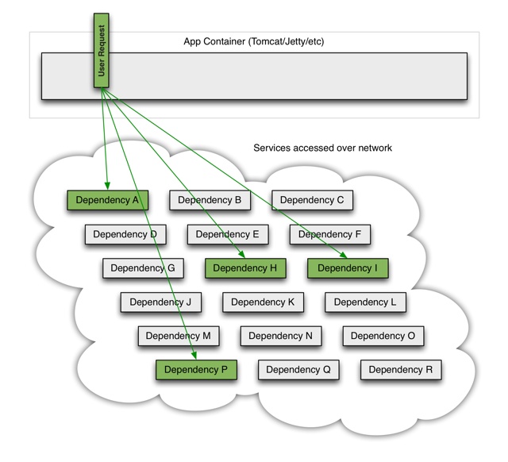
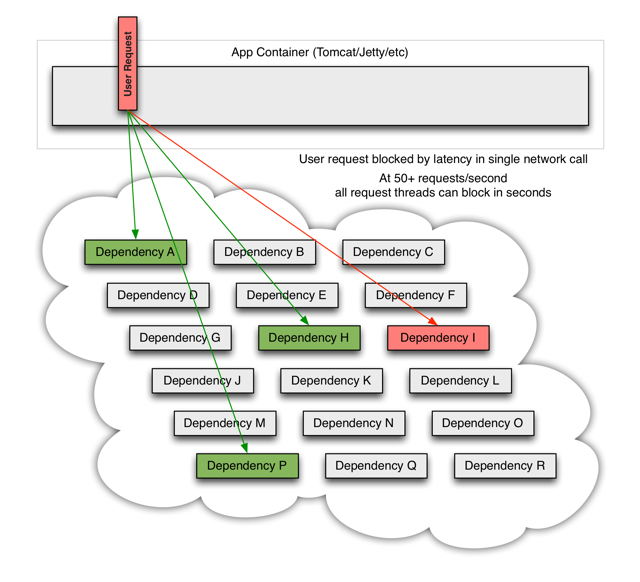
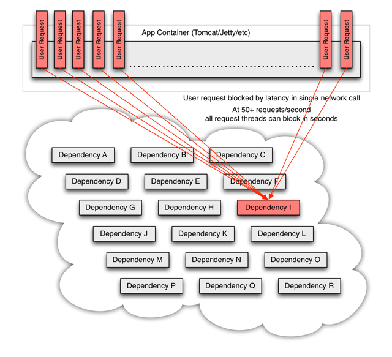
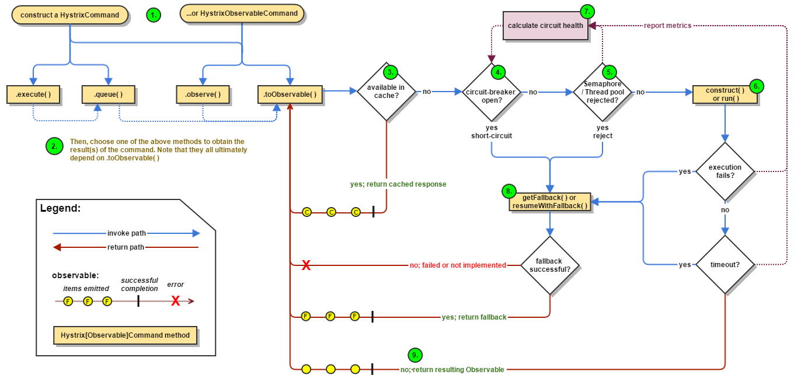
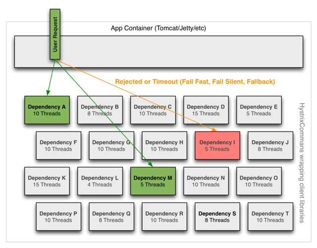
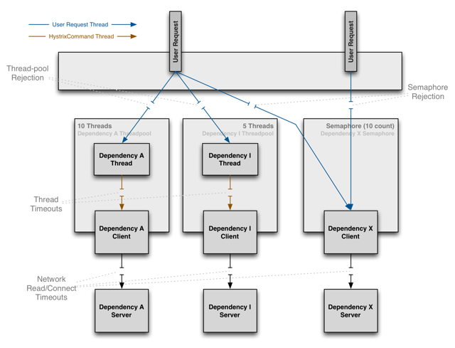

### 一、前言

1、Netflix Hystrix断路器是什么？        
>Netflix Hystrix是SOA/微服务架构中提供服务隔离、熔断、降级机制的工具/框架。Netflix Hystrix是断路器的一种实现，用于高微服务架构的可用性，是防止服务出现雪崩的利器。

2、为什么需要断路器？     
在分布式架构中，一个应用依赖多个服务是非常常见的，如果其中一个依赖由于延迟过高发生阻塞，调用该依赖服务的线程就会阻塞，如果相关业务的QPS较高，就可能产生大量阻塞，从而导致该应用/服务由于服务器资源被耗尽而拖垮。

另外，故障也会在应用之间传递，如果故障服务的上游依赖较多，可能会引起服务的雪崩效应。就跟数据瘫痪，会引起依赖该数据库的应用瘫痪是一样的道理。

--------
当一个应用依赖多个外部服务，一切都正常的情况下，如下图：        
     

如果其中一个依赖发生延迟，当前请求就会被阻塞      

出现这种情况后，如果没有应对措施，后续的请求也会被持续阻塞       

每个请求都占用了系统的CPU、内存、网络等资源，如果该应用的QPS较高，那么该应用所以的服务资源会被快速消耗完毕，直至应用死掉。如果这个出问题的依赖（Dependency I），不止这一个应用，亦或是受影响的应用上层也有更多的依赖，那就会带来我们前面所提到的服务雪崩效应。

所以，为了应对以上问题，就需要有支持服务隔离、熔断等操作的工具

### 二、Hystrix 简介
1、Hystrix具备哪些能力/优点？     
- 在通过网络依赖服务出现高延迟或者失败时，为系统提供保护和控制
- 可以进行快速失败，缩短延迟等待时间和快速恢复：当异常的依赖回复正常后，失败的请求所占用的线程会被快速清理，不需要额外等待      
- 提供失败回退（Fallback）和相对优雅的服务降级机制
- 提供有效的服务容错监控、报警和运维控制手段

2、Hystrix 如何解决级联故障/防止服务雪崩？
- Hystrix将请求的逻辑进行封装，相关逻辑会在独立的线程中执行
- Hystrix有自动超时策略，如果外部请求超过阈值，Hystrix会以超时来处理
- Hystrix会为每个依赖维护一个线程池，当线程满载，不会进行线程排队，会直接终止操作
- Hystrix有熔断机制： 在依赖服务失效比例超过阈值时，手动或者自动地切断服务一段时间

  所以，当引入了Hystrix之后，当出现某个依赖高延迟的时候：

### 三、Hystrix 工作原理
1、Hystrix工作流        
      

- 1、创建HystrixCommand 或者 HystrixObservableCommand 对象
- 2、执行命令execute()、queue()、observe()、toObservable()
- 3、如果请求结果缓存这个特性被启用，并且缓存命中，则缓存的回应会立即通过一个Observable对象的形式返回
- 4、检查熔断器状态，确定请求线路是否是开路，如果请求线路是开路，Hystrix将不会执行这个命令，而是直接执行getFallback
- 5、如果和当前需要执行的命令相关联的线程池和请求队列，Hystrix将不会执行这个命令，而是直接执行getFallback
- 6、执行HystrixCommand.run()或HystrixObservableCommand.construct()，如果这两个方法执行超时或者执行失败，则执行getFallback()
- 7、Hystrix 会将请求成功，失败，被拒绝或超时信息报告给熔断器，熔断器维护一些用于统计数据用的计数器。

这些计数器产生的统计数据使得熔断器在特定的时刻，能短路某个依赖服务的后续请求，直到恢复期结束，若恢复期结束根据统计数据熔断器判定线路仍然未恢复健康，熔断器会再次关闭线路。

[依赖隔离]      
Hystrix采用舱壁隔离模式隔离相互之间的依赖关系，并限制对其中任何一个的并发访问。     
    

线程&线程池      
客户端（通常指Web应用）通过网络请求依赖时，Hystrix会将请求外部依赖的线程与会将App容器(Tomcat/Jetty/…)线程隔离开，以免请求依赖出现延迟时影响请求线程。       
         

Hystrix会为每个依赖维护一个线程池，当线程满载，不会进行线程排队，会Return fallback或者抛出异常      
     

可能会有人有疑问，为什么不依赖于HTTP Client去做容错保护（快速失败、熔断等），而是在访问依赖之外通过线程&线程池隔离的方式做这个断路器（Hystrix）。

主要是以下几个方面：          
- 1、不同的依赖执行的频率不同，需要分开来对待
- 2、不同的依赖可能需要不同的Client的工具/协议来访问，比如我们可能用HTTP Client，可能用Thrift Client。
- 3、Client在执行的过程中也可能会出现非网络异常，这些都应该被隔离       
- 4、Client的变化会引起断路器的变化      

所以，Hystrix这样设计的好处是：

- 1、断路器功能与不同的Client Library隔离
- 2、不同依赖之间的访问互不影响
- 3、当发生大量异常时，不会造成App Container的响应线程排队，并且当异常的依赖恢复正常后，失败的请求所占用的线程会被快速清理，不需要额外等待
- 4、为不支持异步的依赖提供了异步的可能       

这样做的成本是，多了一些线程上的资源消耗（排队，调度和上下文切换），不过从官方给到的数据上可能，这个消耗完全可以接受。目前Netflix每天有100亿+的Hystrix命令执行，平均每个应用实例都有40+个线程池。每个线程池有5-20个线程
依然运行良好（不过这里 ken.io 不得不吐槽下，官方没有透露单个实例硬件配置）       
官方给了一组测试数据，在单个应用实例60QPS，且每秒钟有350个Hystix子线程（350次Hystrix Command执行）的情况下。Hystrix的线程成本通常为0-3ms，如果CPU使用率超过90%，这个线程成本为有所上升约为9ms。相对于网络请求的时间消耗，这个成本完全可以接受。      

