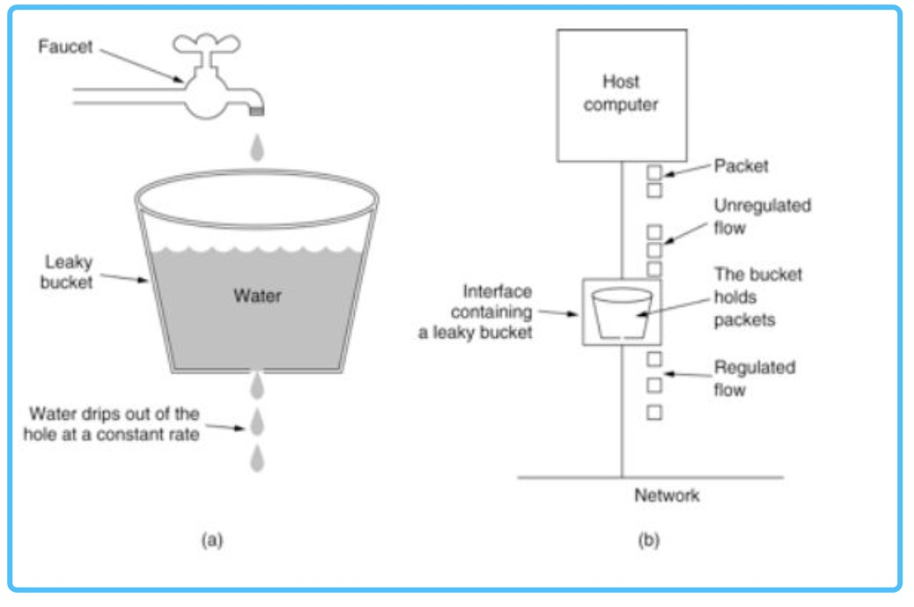
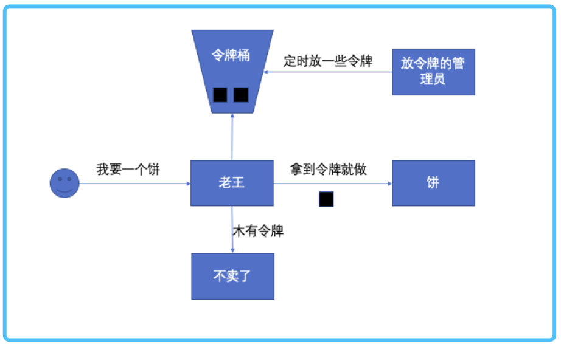
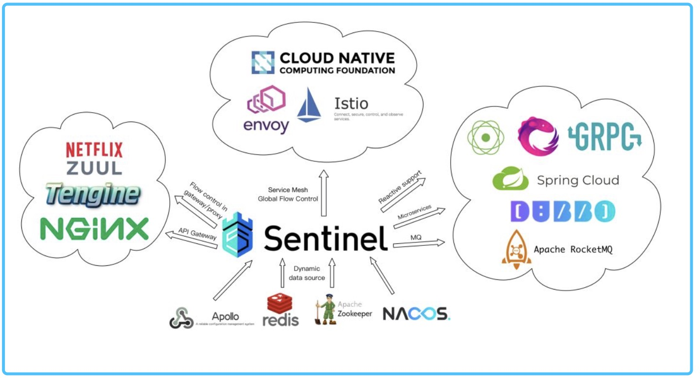
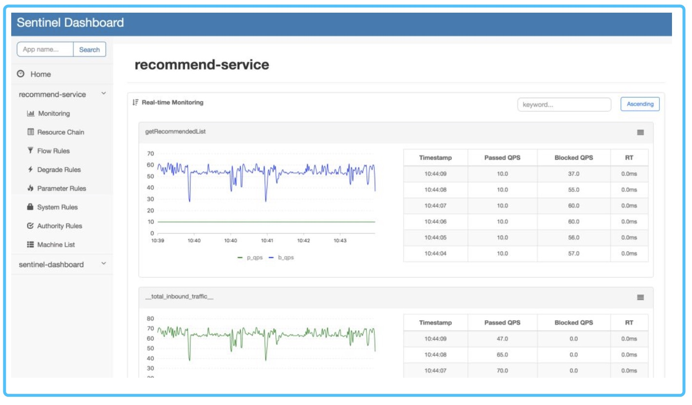

```
限流算法：计数器、滑动窗口、漏桶、令牌桶。
限流方案：Guava的RateLimiter、Alibaba  Sentinel
```

-----

大家都知道，对于高并发的业务场景，我们为了保障服务的稳定，经常会祭出三大利器：缓存、熔断降级和服务限流。        

服务限流作为一个核心的自保护机制，能够在非常高并发的情况下，其他机制都无法保障降级的情况下，保护系统不崩溃，以免产生雪崩效应。

我们设想这么一个场景。
> 名词解析，QPS(query per second 每秒查询数)
  单台机器可以承受的最高QPS为 100，我们有5台机器，日常服务 QPS 为 300。
  那么其实我们是毫无压力，根据前置的负载均衡服务器，每台 300/5 = 60 。可以完美提供服务。
  今天，老板突然搞了一波促销，QPS 达到了 800。
  好了，机器 A 的 QPS 达到了 160，已经完全扛不住了，直接宕机了。这时候集群只剩下4台机器，QPS依然是 800。平均分配到剩下的 4 台机器上，每台机器 200。就这样，机器一台一台倒下，雪崩了。       

那如果我们的系统有限流，会是什么样的场景呢？
> QPS 达到了800。好了，机器 A 的 QPS 达到了 160，但因为限流了100，所以机器依然正常运行，只是损失了 60 QPS 的客户，整个集群整体还是正常运行的。这时候就给开发和运营们留下时间开始降级扩容 bala bala....

可见，限流对于系统的自保护是非常重要的存在，然而很多工程师并没有正视它，或者说只是会用，并不清楚背后的原理。先说下结论。        
```
常见的限流算法有：计数器、滑动窗口、漏桶、令牌桶。
常见的限流方案有：Guava的RateLimiter、基于分布式锁的令牌桶、Alibaba  Sentinel
```

### 【1-计数器】
一般来说，计数器比较粗暴，就是看单位时间内，所接受的 QPS 的请求有多少，如果超过阈值，则直接拒绝服务。大概场景是这样的。      

有这么一个煎饼果子摊，摊主叫老王，上面的老板说你一分钟只许卖 6 个饼（计数限流1分钟6个）。如果在前 0.1 秒已经有人预定了6个饼而且老王刚好神来之笔也已经做完了，那么老王在接下来的 59.59 秒只能坐在凳子上，等待下一分钟的到来。     

看，简单粗暴的计数器，在系统性能允许的情况下，可能会浪费非常多的资源

###【2-滑动窗口】

滑动窗口可以看做计数器的精细化实现，之前只能一分钟一分钟往前赶，现在可以根据实现的精细化 一秒一秒往前赶，虽然整体原理还是靠计数器。既往不咎，是一个适当时间里懂得忘记的计数器。        

###【3-漏桶】
看这张图可以看到漏桶的基础原理，我们会用一个桶作为缓冲区，所有的请求都先丢到桶里。系统以恒定速率慢慢消化这些请求。比较常见的实现就是队列，用一个缓冲区来保存没处理的请求，然后消费者恒定速度抓取一些请求进行处理。               

        

有这么一个煎饼果子摊，摊主叫老王，老王一秒钟只能做一个饼。现在来了 100个顾客，那怎么办呢？就排队啊。老王的老婆啊潘，把这批顾客引导到了旁边的空地上站着，并给他们一个一个标记了号码。老王做完一个，就大喊一声号码，对应的的顾客就过来把饼拿走。

你看看这里的要求，要求有空地（桶），而且顾客等得起（等待时间）。

### 【3-令牌桶】
我们会有一个令牌管理员，按照一定的策略往令牌桶里放令牌。系统每接受到一个请求的时候，都会请求要一个令牌。如果拿到令牌，那么就处理这个请求，拿不到就直接拒绝这个请求。那么只要令牌发放的策略正确，这个系统就不会被拖垮，也能对机器的利用率更高。

  

有这么一个煎饼果子摊，摊主叫老王，老王也不知道自己能做几个饼。老王的老婆阿潘在老王旁边放了一个桶，里边放了一些牌子，并告诉老王，"我帮你看着，你看见有令牌你就做就是了"。   现在来了 100个顾客，老王挖粪涂墙，原来一秒钟只能做一个，现在一秒钟可以做好多个，老王不看顾客了，每次能拿到令牌就直接做。老王的老婆啊潘，眼睛一直看着老王，看看他手抖没是不是要上厕所了。如果手抖了或者可能扛不住了，那就少放一点令牌歇一歇。但如果一次性来了五个 vip 客户，那阿潘就不管那么多了，就直接丢多几个令牌让老王忙一点。

我们看到，令牌桶的方法可以根据系统负载，实时调节系统的处理能力，能够允许一定量级的瞬时高峰流量的快速消化。


好嘞。方案和算法基本上就说完了，现在聊聊限流关于现有的实现，我们当然是非常希望可以不做过多的开发，开箱即用完事，幸运的是，我们已经有不少的开源实现，就算自己实现也不会特别难。


-----
###【使用】

###【01-RateLimiter】
```
 <dependency>
      <groupId>com.google.guava</groupId>
      <artifactId>guava</artifactId>
      <version>25.1-jre</version>
  </dependency>
```
使用Guava的RateLimiter进行限流控制，主要有两种核心模式，SmoothBursty 和 SmoothWarmingUp。SmoothBursty 每秒钟发放N个令牌，也允许预先借用一定数量的令牌。SmoothWarmingUp，在系统刚刚启动的时候，只会按最低阈值发放令牌，然后逐渐增加到设定的最高阈值。     

```text
RateLimiter smoothBuisty = RateLimiter.create(1);
RateLimiter smoothWarmingUp = RateLimiter.create(1 , 1 , TimeUnit.SECONDS);
smoothBuisty.acquire();
smoothWarmingUp.acquire(5);
```
acquire() 方法会阻塞，直到令牌桶返回，还可以一次性拿到N个令牌。但是 RateLimiter 是单机版的，如果我们想要实现分布式，那可以基于 RateLimiter 的原理，实现以下分布式的，可以使用 Redis 等分布式锁来进行实现。     

###【02-Alibaba sentinel】
https://github.com/alibaba/Sentinel.git

Sentinel 是一个带配置中心的分布式缓存，以 "资源名称" 为统计点，提供了多种方式的限流方案，可以基于 QPS、线程数，甚至系统 load 进行集群规模的限流。Sentinel 在整个生态的位置是这样的。  



使用限流的代码非常简单，只需要定义一个 String 类型的资源，作为唯一标识，Sentinel 会根据规则进行限流。

```text
try (Entry entry = SphU.entry("HelloWorld")) {
    // Your business logic here.
    System.out.println("hello world");
} catch (BlockException e) {
    // Handle rejected request.
    e.printStackTrace();
}
```  

定义限流规则的也代码非常简单，只需要定义一个 String 类型的资源，作为唯一标识，Sentinel 会根据规则进行限流。

```text
private static void initFlowRules(){
    List<FlowRule> rules = new ArrayList<>();
    FlowRule rule = new FlowRule();
    rule.setResource("HelloWorld");
    rule.setGrade(RuleConstant.FLOW_GRADE_QPS);
    // Set limit QPS to 20.
    rule.setCount(20);
    rules.add(rule);
    FlowRuleManager.loadRules(rules);
}
```

也提供了 DashBoard 进行实时规则调整。



~~~ok,到这里就完了～～～

原文：https://mp.weixin.qq.com/s/Qf8X4idIX7STPmLdhr1V0w