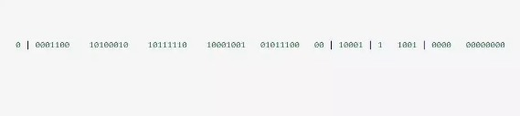
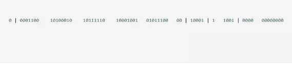

# 【雪花算法】

## 【背景】
SnowFlake 算法，是 Twitter 开源的分布式 id 生成算法。其核心思想就是：使用一个 64 bit 的 long 型的数字作为全局唯一 id。在分布式系统中的应用十分广泛，且ID 引入了时间戳，基本上保持自增的。

这 64 个 bit 中，其中 1 个 bit 是不用的，然后用其中的 41 bit 作为毫秒数，用 10 bit 作为工作机器 id，12 bit 作为序列号。



## 【原理】
给大家举个例子吧，比如下面那个 64 bit 的 long 型数字：

第一个部分，是 1 个 bit：0，这个是无意义的。

第二个部分是 41 个 bit：表示的是时间戳。

第三个部分是 5 个 bit：表示的是机房 id，10001。

第四个部分是 5 个 bit：表示的是机器 id，1 1001。

第五个部分是 12 个 bit：表示的序号，就是某个机房某台机器上这一毫秒内同时生成的 id 的序号，0000 00000000。

①1 bit：是不用的，为啥呢？

 

因为二进制里第一个 bit 为如果是 1，那么都是负数，但是我们生成的 id 都是正数，所以第一个 bit 统一都是 0。

 

②41 bit：表示的是时间戳，单位是毫秒。

 

41 bit 可以表示的数字多达 2^41 - 1，也就是可以标识 2 ^ 41 - 1 个毫秒值，换算成年就是表示 69 年的时间。

 

③10 bit：记录工作机器 id，代表的是这个服务最多可以部署在 2^10 台机器上，也就是 1024 台机器。

 

但是 10 bit 里 5 个 bit 代表机房 id，5 个 bit 代表机器 id。意思就是最多代表 2 ^ 5 个机房（32 个机房），每个机房里可以代表 2 ^ 5 个机器（32 台机器）。

 

④12 bit：这个是用来记录同一个毫秒内产生的不同 id。

 

12 bit 可以代表的最大正整数是 2 ^ 12 - 1 = 4096，也就是说可以用这个 12 bit 代表的数字来区分同一个毫秒内的 4096 个不同的 id。

 

简单来说，你的某个服务假设要生成一个全局唯一 id，那么就可以发送一个请求给部署了 SnowFlake 算法的系统，由这个 SnowFlake 算法系统来生成唯一 id。

 

这个 SnowFlake 算法系统首先肯定是知道自己所在的机房和机器的，比如机房 id = 17，机器 id = 12。

 

接着 SnowFlake 算法系统接收到这个请求之后，首先就会用二进制位运算的方式生成一个 64 bit 的 long 型 id，64 个 bit 中的第一个 bit 是无意义的。

 

接着 41 个 bit，就可以用当前时间戳（单位到毫秒），然后接着 5 个 bit 设置上这个机房 id，还有 5 个 bit 设置上机器 id。

 

最后再判断一下，当前这台机房的这台机器上这一毫秒内，这是第几个请求，给这次生成 id 的请求累加一个序号，作为最后的 12 个 bit。

 

最终一个 64 个 bit 的 id 就出来了，类似于：



这个算法可以保证说，一个机房的一台机器上，在同一毫秒内，生成了一个唯一的 id。可能一个毫秒内会生成多个 id，但是有最后 12 个 bit 的序号来区分开来。

 

下面我们简单看看这个 SnowFlake 算法的一个代码实现，这就是个示例，大家如果理解了这个意思之后，以后可以自己尝试改造这个算法。

 

总之就是用一个 64 bit 的数字中各个 bit 位来设置不同的标志位，区分每一个 id。
————————————————

## 【实现代码】
```java
public class IdWorker {
    private long workerId; // 这个就是代表了机器id
    private long datacenterId; // 这个就是代表了机房id
    private long sequence; // 这个就是代表了一毫秒内生成的多个id的最新序号
    public IdWorker(long workerId, long datacenterId, long sequence) {
        // sanity check for workerId
        // 这儿不就检查了一下，要求就是你传递进来的机房id和机器id不能超过32，不能小于0
        if (workerId > maxWorkerId || workerId < 0) {
 
            throw new IllegalArgumentException(
                    String.format("worker Id can't be greater than %d or less than 0",maxWorkerId));
        }
 
        if (datacenterId > maxDatacenterId || datacenterId < 0) {
 
            throw new IllegalArgumentException(
                    String.format("datacenter Id can't be greater than %d or less than 0",maxDatacenterId));
        }
        this.workerId = workerId;
        this.datacenterId = datacenterId;
        this.sequence = sequence;
    }
    private long twepoch = 1288834974657L;
    private long workerIdBits = 5L;
    private long datacenterIdBits = 5L;
 
    // 这个是二进制运算，就是5 bit最多只能有31个数字，也就是说机器id最多只能是32以内
    private long maxWorkerId = -1L ^ (-1L << workerIdBits);
    // 这个是一个意思，就是5 bit最多只能有31个数字，机房id最多只能是32以内
    private long maxDatacenterId = -1L ^ (-1L << datacenterIdBits);
    private long sequenceBits = 12L;
    private long workerIdShift = sequenceBits;
    private long datacenterIdShift = sequenceBits + workerIdBits;
    private long timestampLeftShift = sequenceBits + workerIdBits + datacenterIdBits;
    private long sequenceMask = -1L ^ (-1L << sequenceBits);
    private long lastTimestamp = -1L;
    public long getWorkerId(){
        return workerId;
    }
    public long getDatacenterId() {
        return datacenterId;
    }
    public long getTimestamp() {
        return System.currentTimeMillis();
    }
    // 这个是核心方法，通过调用nextId()方法，让当前这台机器上的snowflake算法程序生成一个全局唯一的id
    public synchronized long nextId() {
        // 这儿就是获取当前时间戳，单位是毫秒
        long timestamp = timeGen();
        if (timestamp < lastTimestamp) {
            System.err.printf(
                    "clock is moving backwards. Rejecting requests until %d.", lastTimestamp);
            throw new RuntimeException(
                    String.format("Clock moved backwards. Refusing to generate id for %d milliseconds",
                            lastTimestamp - timestamp));
        }
 
        // 下面是说假设在同一个毫秒内，又发送了一个请求生成一个id
        // 这个时候就得把seqence序号给递增1，最多就是4096
        if (lastTimestamp == timestamp) {
 
            // 这个意思是说一个毫秒内最多只能有4096个数字，无论你传递多少进来，
            //这个位运算保证始终就是在4096这个范围内，避免你自己传递个sequence超过了4096这个范围
            sequence = (sequence + 1) & sequenceMask;
            if (sequence == 0) {
                timestamp = tilNextMillis(lastTimestamp);
            }
 
        } else {
            sequence = 0;
        }
        // 这儿记录一下最近一次生成id的时间戳，单位是毫秒
        lastTimestamp = timestamp;
        // 这儿就是最核心的二进制位运算操作，生成一个64bit的id
        // 先将当前时间戳左移，放到41 bit那儿；将机房id左移放到5 bit那儿；将机器id左移放到5 bit那儿；将序号放最后12 bit
        // 最后拼接起来成一个64 bit的二进制数字，转换成10进制就是个long型
        return ((timestamp - twepoch) << timestampLeftShift) |
                (datacenterId << datacenterIdShift) |
                (workerId << workerIdShift) | sequence;
    }
    private long tilNextMillis(long lastTimestamp) {
 
        long timestamp = timeGen();
 
        while (timestamp <= lastTimestamp) {
            timestamp = timeGen();
        }
        return timestamp;
    }
    private long timeGen(){
        return System.currentTimeMillis();
    }
    //---------------测试---------------
    public static void main(String[] args) {
 
        IdWorker worker = new IdWorker(1,1,1);
 
        for (int i = 0; i < 30; i++) {
            System.out.println(worker.nextId());
        }
    }
}

```
实际中我们的机房并没有那么多，我们可以改进改算法，将10bit的机器id优化，成业务表或者和我们系统相关的业务。

[原文]https://blog.csdn.net/lq18050010830/article/details/89845790