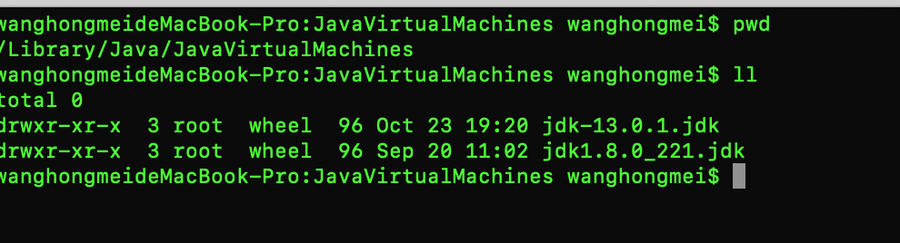
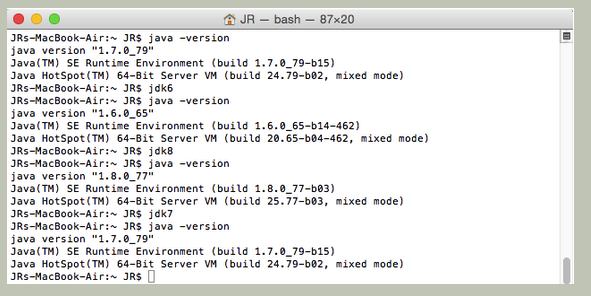

###【基本信息】      
MAC的JDK默认安装路径为/Library/Java/JavaVirtualMachines
如图：


### 【具体操作】
1、执行以下命令
```
cd ~
 open -e .bash_profile  #打开.bash_profile文件
```
注:假如.bash_profile文件不存在执行下面命令新建文件
```
cd ~
touch .bash_profile #新建.bash_profile文件
ls -a #查看文件是否创建成功
```

2、在打开的.bash_profile文件中添加下面内容然后关闭
```
#添加JDK的环境变量
export JAVA_6_HOME=/Library/Java/JavaVirtualMachines/1.6.0_65-b14-462.jdk/Contents/Home
export JAVA_7_HOME=/Library/Java/JavaVirtualMachines/jdk1.7.0_79.jdk/Contents/Home
export JAVA_8_HOME=/Library/Java/JavaVirtualMachines/jdk1.8.0_77.jdk/Contents/Home
#默认JDK1.7
export JAVA_HOME=$JAVA_7_HOME
#alias命令动态切换JDK版本  
alias jdk6="export JAVA_HOME=$JAVA_6_HOME"  
alias jdk7="export JAVA_HOME=$JAVA_7_HOME"
alias jdk8="export JAVA_HOME=$JAVA_8_HOME"
```

3、设置生效
```
cd ~
source .bash_profile #设置配置立即生效
```

4.验证是否安装成功
